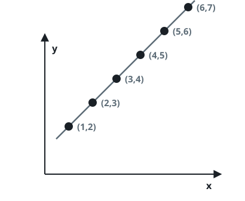
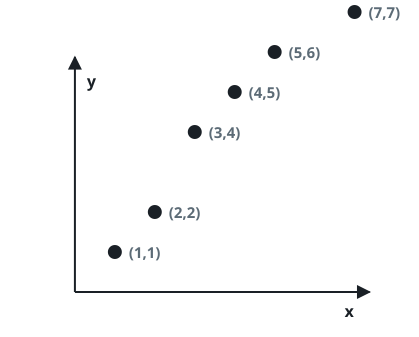

# Points On One Line

## Description

You receive a list `coordinates` of points in the plane, where
`coordinates[i] = [x, y]` holds the two integer coordinates of the i-th
point. Decide whether every point in the list sits on one common straight
line, and answer `true` when they do, `false` otherwise.

### Example 1



```text
Input: coordinates = [[1,2],[2,3],[3,4],[4,5],[5,6],[6,7]]
Output: true
```

### Example 2



```text
Input: coordinates = [[1,1],[2,2],[3,4],[4,5],[5,6],[7,7]]
Output: false
```

### Example 3

```text
Input: coordinates = [[4,7],[4,-2],[4,10]]
Output: true
Explanation: All three points share x = 4, so they lie on one vertical
line.
```

### Example 4

```text
Input: coordinates = [[0,0],[1,1],[2,3]]
Output: false
Explanation: The first two points determine a diagonal, and [2,3] sits
above it.
```

### Constraints

- `2 <= coordinates.length <= 1000`
- `coordinates[i].length == 2`
- `-10⁴ <= coordinates[i][0], coordinates[i][1] <= 10⁴`
- No point appears twice in `coordinates`.

## Hints

### Hint 1

With exactly two points the answer is always `true` — two distinct points
always share a line.

### Hint 2

Take the direction from the first point to the second as fixed, then verify
that each remaining point stays on that same line.

### Hint 3

Avoid slopes and division entirely: compare cross products, which vanish
exactly when the tested point lines up — vertical lines included.
