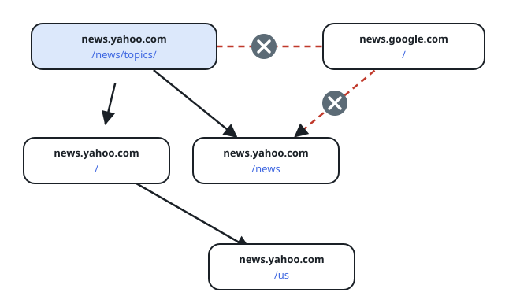

# Same-Site Page Harvest

## Description

Starting from one page, collect every page that lives under the same
hostname, following links page by page.

Your crawler:

- starts at the page `startUrl`;
- calls `LinkIndex.linksFrom(url)` to read the links listed on a page;
- never harvests the same URL twice;
- keeps only links whose hostname matches `startUrl`'s hostname.

For simplicity every URL uses the http protocol with no port. The hostname
is the authority part of the URL: `http://example.org/test` and
`http://example.org/misc` share the hostname `example.org`, while
`http://example.org/a` and `http://example.com/b` do not. Treat a trailing
slash as significant — `"http://news.example.com"` and
`"http://news.example.com/"` are different URLs.


The `LinkIndex` interface is defined as such:

```text
interface LinkIndex {
  // Return a list of all urls listed on the page of the given url.
  public List<String> linksFrom(String url);
}
```

A test case is described by three variables — `urls`, `edges`, and
`startUrl` — but your code only ever receives `startUrl` (wrapped with the
`LinkIndex`); the graph itself is hidden behind the interface.

Implement `harvestSite(startUrl, linkIndex)` and return every harvested URL
in any order.

**Note (OpenOJ):** the judge builds the page graph described by `urls` and
`edges` (an edge `[i, j]` means page `urls[i]` lists `urls[j]`), hands your
method a `LinkIndex` over it, and compares the set of URLs you return
against the expected set, order-insensitively.

### Example 1



```text
Input:
urls = [
  "http://news.yahoo.com",
  "http://news.yahoo.com/news",
  "http://news.yahoo.com/news/topics/",
  "http://news.google.com",
  "http://news.yahoo.com/us"
]
edges = [[2,0],[2,1],[3,2],[3,1],[0,4]]
startUrl = "http://news.yahoo.com/news/topics/"
Output: ["http://news.yahoo.com","http://news.yahoo.com/news","http://news.yahoo.com/news/topics/","http://news.yahoo.com/us"]
```

### Example 2


```text
Input:
urls = [
  "http://news.yahoo.com",
  "http://news.yahoo.com/news",
  "http://news.yahoo.com/news/topics/",
  "http://news.google.com"
]
edges = [[0,2],[2,1],[3,2],[3,1],[3,0]]
startUrl = "http://news.google.com"
Output: ["http://news.google.com"]
```

### Constraints

- `1 <= urls.length <= 1000`
- `1 <= urls[i].length <= 300`
- `startUrl` is one of the `urls`.
- Each hostname in the corpus has at most 300 pages.
- Any two URLs that share a hostname are under that same hostname.

## Hints

### Hint 1

This is graph reachability: pages are nodes and listed links are directed
edges.

### Hint 2

Keep a set of visited URLs so each page is expanded once; the hostname
filter decides which neighbors count.
