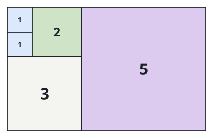

# Fewest Squares to Tile a Rectangle

## Description

Cover an `n x m` rectangle exactly with integer-sided squares: every square
sits inside the rectangle, aligned with its edges, and together the squares
leave no gap and no overlap. Return the smallest number of squares any such
covering can use.

### Example 1


```text
Input: n = 2, m = 3
Output: 3
Explanation: Three squares are unavoidable here — one 2x2 square plus two
1x1 squares to finish the leftover column.
```

### Example 2



```text
Input: n = 5, m = 8
Output: 5
```

### Example 3


```text
Input: n = 11, m = 13
Output: 6
```

### Constraints

- `1 <= n, m <= 13`

## Hints

### Hint 1

Try a backtracking search over square placements. What is the smallest
state that captures a partially covered board?

### Hint 2

After some squares are placed, the next one has a natural home: the first
still-empty cell in top-to-bottom, left-to-right order.

### Hint 3

Track the best complete covering found so far and cut off any branch that
has already placed that many squares; trying larger sides first reaches a
strong answer early, which makes this pruning very effective.
