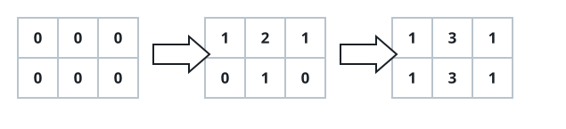
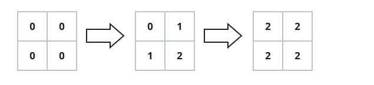

# Odd Cells After Cross Increments

## Description

Start with an `m x n` grid of zeros and a list `indices`, where each entry
`indices[i] = [ri, ci]` names one row and one column. Applying that entry
means:

- adding one to every cell in row `ri`, and
- adding one to every cell in column `ci`.

The intersection cell sits in both, so an application raises it by two.
Apply the entries in order and return how many cells hold an odd value when
the last application finishes.

### Example 1



```text
Input: m = 2, n = 3, indices = [[0,1],[1,1]]
Output: 6
Explanation: The grid runs [[0,0,0],[0,0,0]] -> [[1,2,1],[0,1,0]] ->
[[1,3,1],[1,3,1]], and every one of the six final cells is odd.
```

### Example 2



```text
Input: m = 2, n = 2, indices = [[1,1],[0,0]]
Output: 0
Explanation: The final grid is [[2,2],[2,2]] — every cell was touched
twice, so no odd values remain.
```

### Constraints

- `1 <= m, n <= 50`
- `1 <= indices.length <= 100`
- `0 <= ri < m`
- `0 <= ci < n`

### Follow-up

Can you get the answer in `O(indices.length + m + n)` time using only
`O(m + n)` extra space?

## Hints

### Hint 1

With these bounds, applying every increment to the grid directly and
counting odd cells afterwards is perfectly fine.

### Hint 2

Faster: just track how many times each row and each column was incremented
— a cell ends odd exactly when the parities of its row count and column
count differ.
