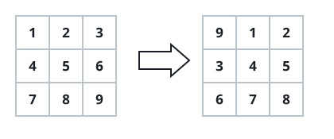
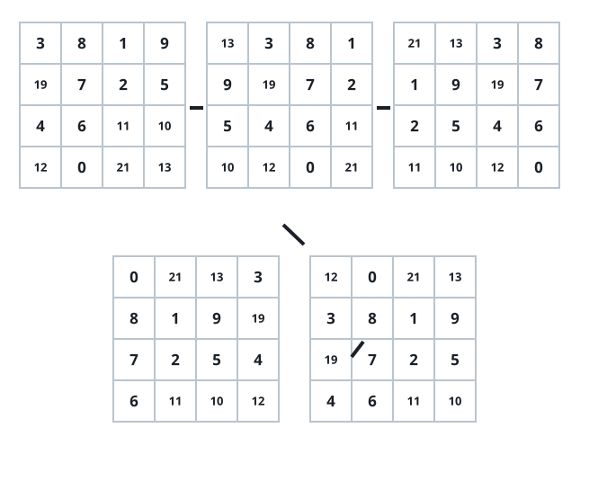

# Roll the Grid Forward

## Description

You are given an `m x n` grid of integers and an integer `k`. Roll the grid
forward `k` times and return the result.

One roll moves every cell one step forward in reading order:

- The value at `grid[i][j]` slides to `grid[i][j + 1]`.
- The value at the end of a row, `grid[i][n - 1]`, wraps to the start of
  the next row, `grid[i + 1][0]`.
- The value at the very last cell, `grid[m - 1][n - 1]`, wraps all the way
  around to `grid[0][0]`.

### Example 1



```text
Input: grid = [[1,2,3],[4,5,6],[7,8,9]], k = 1
Output: [[9,1,2],[3,4,5],[6,7,8]]
```

### Example 2



```text
Input: grid = [[3,8,1,9],[19,7,2,5],[4,6,11,10],[12,0,21,13]], k = 4
Output: [[12,0,21,13],[3,8,1,9],[19,7,2,5],[4,6,11,10]]
```

### Example 3

```text
Input: grid = [[5,-2],[7,0],[3,9]], k = 6
Output: [[5,-2],[7,0],[3,9]]
Explanation: The grid holds 6 cells, so rolling 6 times brings every value
back to where it started.
```

### Constraints

- `m == grid.length`
- `n == grid[i].length`
- `1 <= m <= 50`
- `1 <= n <= 50`
- `-1000 <= grid[i][j] <= 1000`
- `0 <= k <= 100`

## Hints

### Hint 1

One roll moves each value one slot forward in reading order; only the
values leaving a row's last cell need special care.

### Hint 2

Read the grid into a single list of `m*n` values. Rolling by
`k % (m*n)` then amounts to rotating that list — move the last few values
to the front and write the list back row by row.
