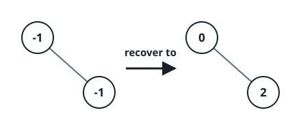
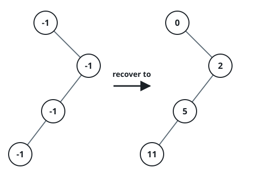

# Find Values In a Rebuilt Tree

## Description

A binary tree was built according to these rules:

- The root's value is `0`.
- Whenever a node holds the value `x`, its left child (if it exists) holds
  `2 * x + 1`, and its right child (if it exists) holds `2 * x + 2`.

Every node's value was then wiped to `-1`, but the shape of the tree is
untouched — so the values can be reconstructed from the rules above.

Implement the `RebuiltTree` class:

- `RebuiltTree(TreeNode root)` initializes the object with the wiped tree
  and restores every value.
- `boolean find(int target)` returns `true` if the restored tree contains a
  node whose value is `target`, or `false` otherwise.

### Example 1



```text
Input:
["RebuiltTree","find","find"]
[[[-1,null,-1]],[1],[2]]
Output: [null,false,true]
Explanation: The root is recovered as 0 and its right child as 2. Value 1
is not in the tree because the root has no left child; value 2 is.
```

### Example 2


```text
Input:
["RebuiltTree","find","find","find"]
[[[-1,-1,-1,-1,-1]],[1],[3],[5]]
Output: [null,true,true,false]
Explanation: The recovered values are 0 at the root, 1 and 2 on the second
level, and 3 and 4 on the third, so 1 and 3 are found while 5 is not.
```

### Example 3



```text
Input:
["RebuiltTree","find","find","find","find"]
[[[-1,null,-1,-1,null,-1]],[2],[3],[4],[5]]
Output: [null,true,false,false,true]
Explanation: Recovering by the doubling rules yields 0 at the root, 2 as
its right child, 5 as that node's left child, and 11 below it, so 2 and 5
are found while 3 and 4 are absent.
```

### Constraints

- The tree contains between `1` and `10⁴` nodes.
- `treeNode.val == -1` for every node of the given tree.
- `0 <= target <= 10⁶`
- At most `10⁴` calls are made to `find`.

## Hints

### Hint 1

Walk the tree once from the root, restoring each child's value from its
parent's recovered value.

### Hint 2

Collect the recovered values into a set so each `find` is a single lookup.
