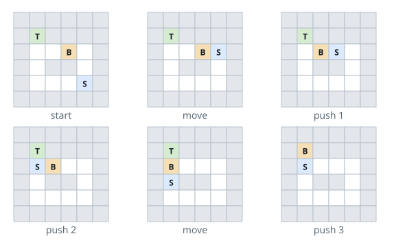

# Box Pushing Puzzle

## Description

A warehouse puzzle is played on an `m x n` grid. One cell holds the
keeper (`'S'`), one holds a crate (`'B'`), and one marks the crate's
delivery spot (`'T'`). Walls are `'#'`; open floor is `'.'`.

The keeper walks up, down, left, or right onto floor cells. Walls block
her, and so does the crate — she cannot step through or over it.

The crate only moves when the keeper pushes it: she stands on the floor
cell directly on one side of the crate and steps toward it, which slides
the crate one cell in that direction. The cell the crate slides into must
be free floor.

Return the minimum number of pushes needed to slide the crate onto the
delivery spot, or `-1` if that can never happen. Steps the keeper takes
on her own do not count.

### Example 1



```text
Input: grid = [["#","#","#","#","#","#"],
               ["#","T","#","#","#","#"],
               ["#",".",".","B",".","#"],
               ["#",".","#","#",".","#"],
               ["#",".",".",".","S","#"],
               ["#","#","#","#","#","#"]]
Output: 3
Explanation: Only the pushes are tallied — the keeper's own steps are
free.
```

### Example 2

```text
Input: grid = [["#","#","#","#","#","#"],
               ["#","T","#","#",".","#"],
               ["#",".","#","B",".","#"],
               ["#",".",".","#",".","#"],
               ["#","S",".",".",".","#"],
               ["#","#","#","#","#","#"]]
Output: -1
Explanation: Walls seal off every possible push — no direction offers
both a standing spot for the keeper and an open destination — so the
crate can never reach the target.
```

### Example 3

```text
Input: grid = [["#","#","#","#","#"],
               ["#",".","B","T","#"],
               ["#",".",".","S","#"],
               ["#","#","#","#","#"]]
Output: 1
Explanation: The keeper walks around to the crate's left side and gives
it a single push to the right, straight onto the target.
```

### Constraints

- `m == grid.length`
- `n == grid[i].length`
- `1 <= m, n <= 20`
- Every cell of `grid` is one of `'.'`, `'#'`, `'S'`, `'T'`, `'B'`.
- The grid contains exactly one `'S'`, one `'B'`, and one `'T'`.

## Hints

### Hint 1

Each search state is a pair: where the crate is and where the keeper is.
Two states sharing a crate cell but with the keeper on different sides of
it are genuinely different states.

### Hint 2

Only pushes cost anything, so search over crate positions and charge one
step per push; a flood fill from the keeper tells which sides of the
crate she can currently stand on.
