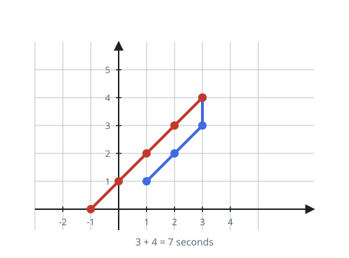

# Checkpoint Tour Time

## Description

A tour must cover `n` checkpoints on a 2D plane, listed in visiting order
as `points[i] = [xi, yi]`. Return the minimum number of seconds the tour
takes.

Each second you take exactly one step, and a step is any of:

- one unit vertically,
- one unit horizontally, or
- one unit diagonally (one unit along each axis within the same second).

The checkpoints have to be visited in the order they appear in `points`.
Passing through a checkpoint that comes later in the order is allowed,
but it does not count as a visit — each checkpoint must be visited in its
turn.

### Example 1



```text
Input: points = [[1,1],[3,4],[-1,0]]
Output: 7
Explanation: One fastest route is
[1,1] -> [2,2] -> [3,3] -> [3,4] -> [2,3] -> [1,2] -> [0,1] -> [-1,0]
Time from [1,1] to [3,4] = 3 seconds
Time from [3,4] to [-1,0] = 4 seconds
Total time = 7 seconds
```

### Example 2

```text
Input: points = [[2,-1],[5,3],[-4,-4]]
Output: 13
Explanation: Reaching `[5,3]` from `[2,-1]` takes 4 seconds, and
reaching `[-4,-4]` from `[5,3]` takes 9, for 13 in total.
```

### Constraints

- `points.length == n`
- `1 <= n <= 100`
- `points[i].length == 2`
- `-1000 <= points[i][0], points[i][1] <= 1000`

## Hints

### Hint 1

In one second, both coordinate gaps — horizontal and vertical — can
shrink by at most one each.

### Hint 2

So the least time a leg can take is the larger of its two gaps: move
diagonally while both are open, then straight along whichever remains.

### Hint 3

Sum that per-leg minimum over consecutive pairs; an early pass through a
future checkpoint never changes the cost.
