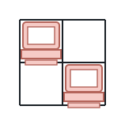
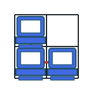
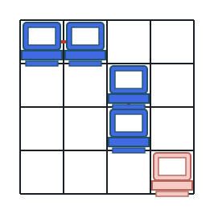

# Servers on Shared Lines

## Description

A server room is laid out as an `m x n` grid of cells, given as an
integer matrix `grid`. A cell holding a machine is marked `1`; an empty
cell is marked `0`.

Two machines are linked when they sit on the same row or on the same
column of the grid. Return how many machines are linked to at least one
other machine.

### Example 1



```text
Input: grid = [[1,0],[0,1]]
Output: 0
Explanation: Each machine is alone on its row and its column, so no
machine shares a line with another.
```

### Example 2



```text
Input: grid = [[1,0],[1,1]]
Output: 3
Explanation: Every machine here shares a row or a column with one of
the others.
```

### Example 3



```text
Input: grid = [[1,1,0,0],[0,0,1,0],[0,0,1,0],[0,0,0,1]]
Output: 4
Explanation: The two machines in the top row share that row, and the
two machines in the third column share that column — four in all. The
machine in the bottom-right corner shares no line with anybody.
```

### Constraints

- `m == grid.length`
- `n == grid[i].length`
- `1 <= m <= 250`
- `1 <= n <= 250`
- `grid[i][j]` is `0` or `1`.

## Hints

### Hint 1

Tally how many machines sit in each row and in each column.

### Hint 2

A machine qualifies exactly when one of its two tallies is greater than
one — then somebody shares a line with it.
