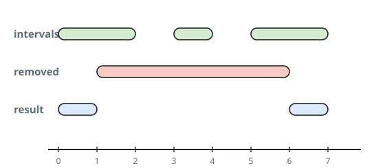
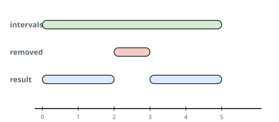

# Cut From Sorted Intervals

## Description

A set of real numbers is described as the union of disjoint half-open
intervals: the interval `[a, b)` holds every `x` with `a <= x < b`.

You are given `intervals`, a sorted list of such disjoint pairs that
describes a set, together with one more half-open interval
`toBeRemoved`. Cut `toBeRemoved` out of the set — return every real
number that belongs to `intervals` but not to `toBeRemoved` — formatted
the same way: a sorted list of disjoint half-open intervals.

### Example 1



```text
Input: intervals = [[0,2],[3,4],[5,7]], toBeRemoved = [1,6]
Output: [[0,1],[6,7]]
```

### Example 2



```text
Input: intervals = [[0,5]], toBeRemoved = [2,3]
Output: [[0,2],[3,5]]
```

### Example 3

```text
Input: intervals = [[1,5],[7,9]], toBeRemoved = [0,10]
Output: []
Explanation: The removal swallows both intervals whole, leaving
nothing behind.
```

### Constraints

- `1 <= intervals.length <= 10^4`
- `-10^9 <= ai < bi <= 10^9`

## Hints

### Hint 1

Deal with each interval on its own — the removal never makes two input
intervals interact.

### Hint 2

Per interval there are only a few outcomes: untouched, a surviving head
piece, a surviving tail piece, or nothing; the half-open ends decide
which.
