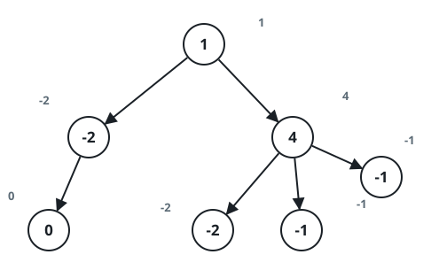

# Remove Zero-Sum Subtrees

## Description

A tree is rooted at node `0` and handed over as three arrays:

- `nodes` is the number of nodes, numbered `0` through `nodes - 1`;
- `parent[i]` is the parent of node `i`, with `parent[0] == -1` marking
  the root;
- `value[i]` is the number written on node `i`.

Cut away every subtree whose values add up to zero — and remember a
subtree means the node plus everything below it.

Return how many nodes are left standing.

### Example 1



```text
Input: nodes = 7, parent = [-1,0,0,1,2,2,2],
value = [1,-2,4,0,-2,-1,-1]
Output: 2
Explanation: Node 3 is a zero-sum subtree all by itself, and the whole
subtree hanging under node 2 sums to zero as well — only the root and
node 1 survive.
```

### Example 2

```text
Input: nodes = 6, parent = [-1,0,1,1,0,4],
value = [2,1,-5,5,4,0]
Output: 5
Explanation: Node 5 carries a zero on its own, so its subtree goes;
every other subtree sums to something nonzero and stays.
```

### Constraints

- `1 <= nodes <= 10^4`
- `parent.length == value.length == nodes`
- `0 <= parent[i] <= nodes - 1`, and `parent[0] == -1`
- `-10^5 <= value[i] <= 10^5`
- The arrays always describe one valid tree.

## Hints

### Hint 1

Work bottom-up: a node can only act once it knows the total of its own
subtree.

### Hint 2

When a subtree's total comes out zero, drop it and hand nothing up to
its parent.
