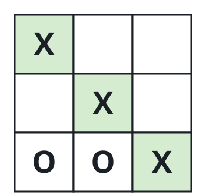
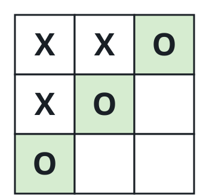
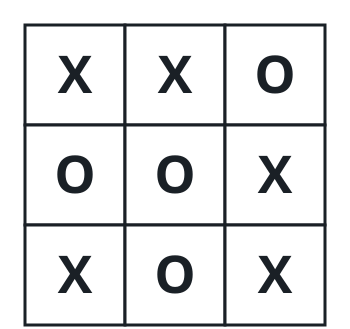

# Tic-Tac-Toe Verdict

## Description

Two players, A and B, play one game of tic-tac-toe on a `3 x 3` board.
A moves first and marks empty cells with `'X'`; B answers with `'O'`.
Marks only ever land on empty cells, play stops as soon as one player
owns an entire row, column, or diagonal, and the board filling up ends
the game too.

You receive the move transcript as a 2D array `moves`, where
`moves[i] = [rowi, coli]` is the cell the `i`-th player marked. Report
the outcome:

- `"A"` or `"B"` if that player completed a line,
- `"Draw"` if the board is full with no line completed,
- `"Pending"` if the game is not over yet and moves remain.

The transcript is guaranteed valid: the board starts empty, A opens,
players alternate, and nothing is played after the game ends.

### Example 1



```text
Input: moves = [[0,0],[2,0],[1,1],[2,1],[2,2]]
Output: "A"
Explanation: A claims the diagonal and wins.
```

### Example 2



```text
Input: moves = [[0,0],[1,1],[0,1],[0,2],[1,0],[2,0]]
Output: "B"
Explanation: B fills the left column.
```

### Example 3



```text
Input: moves = [[0,0],[1,1],[2,0],[1,0],[1,2],[2,1],[0,1],[0,2],[2,2]]
Output: "Draw"
Explanation: Every cell is marked and neither player completed a line.
```

### Constraints

- `1 <= moves.length <= 9`
- `moves[i].length == 2`
- `0 <= rowi, coli <= 2`
- No two moves land on the same cell.
- `moves` is a legal tic-tac-toe transcript.

## Hints

### Hint 1

Testing whether A or B already won is direct: look at each of the three
rows, three columns, and two diagonals and see whether one player holds
all three cells.

### Hint 2

If nobody has a line, the board being full — nine moves played — means
a draw; anything less means the game is still `Pending`.
