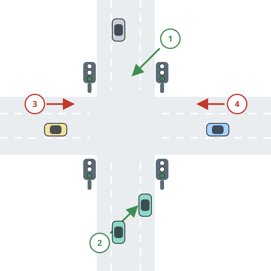

# One Green Light at a Time

## Description

Two roads meet at an intersection. Road A carries northbound traffic in
direction 1 and southbound traffic in direction 2; road B carries
eastbound traffic in direction 3 and westbound traffic in direction 4.



A signal stands on each road before the intersection, and every signal is
either green or red:

- Green lets cars cross the intersection in both directions of that road.
- Red makes cars on that road wait until the signal turns green for them.

The two signals can never both be green: while road A's signal is green,
road B's must be red, and vice versa. The signal starts green on road A.
While one road's signal is green, every car from that road may cross — in
either of its directions — until the signal switches. No two cars from
different roads may ever be inside the intersection at the same time, and
turning a signal green for a road that is already green is forbidden.

Implement the `JunctionSignal` class:

- `void carArrived(int carId, int roadId, int direction, Runnable
turnGreen, Runnable crossCar)` is called when car `carId` arrives on
  road `roadId` traveling in `direction`. Call `turnGreen` to switch the
  signal to green for that road, and `crossCar` to let the car cross.

Your answer is correct as long as cars never deadlock in the intersection
and the green-at-most-one-road rule holds.

### Concurrent judging

The judge starts one real thread per car, handing it `carId`, `roadId`,
and `direction` — all threads start together, so the crossing order is
entirely the scheduler's, not the arrival list's. Each `crossCar` call
appends one structured entry `["pass", carId, roadId, direction]` to a
shared log; `turnGreen` runs for your synchronization only and records
nothing. Many crossing orders are correct, so the log is judged
order-insensitively — a correct run is one in which every car crosses the
intersection exactly once. A solution that deadlocks never returns and is
judged as a timeout.

### Example 1

```text
Input: carArrived calls, in order: carId 1 on road 1 direction 2; carId 3 on road 1 direction 1; carId 5 on road 1 direction 2; carId 2 on road 2 direction 4; carId 4 on road 2 direction 3.
Output: [["pass",1,1,2],["pass",3,1,1],["pass",5,1,2],["pass",2,2,4],["pass",4,2,3]]
Explanation: Road 1's signal starts green, so cars 1, 3, and 5 cross
first. Car 2 then waits for the signal to switch to road 2 before
crossing, and car 4 follows while the signal is still green for road 2.
```

### Example 2

```text
Input: carArrived calls, in order: carId 1 on road 1 direction 2; carId 2 on road 2 direction 4; carId 3 on road 2 direction 3; carId 4 on road 2 direction 3; carId 5 on road 1 direction 1.
Output: [["pass",1,1,2],["pass",2,2,4],["pass",3,2,3],["pass",4,2,3],["pass",5,1,1]]
Explanation: Car 1 crosses on road 1's initial green. Cars 2, 3, and 4
cross together once the signal switches to road 2, and car 5 waits for the
switch back to road 1. Other interleavings that keep the two roads from
mixing are equally correct.
```

### Constraints

- `1 <= carId` and every `carId` is unique.
- `1 <= roadId <= 2`
- `1 <= direction <= 4`
