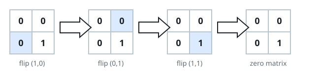

# Fewest Flips to a Blank Grid

## Description

You hold an `m x n` binary matrix `mat` — every cell is `0` or `1`. One
move picks a cell and flips it together with each of its four edge-
adjacent neighbors (a flip turns `1` into `0` and `0` into `1`; a
neighbor shares an edge, not just a corner).

Find the smallest number of moves that leaves every cell of the matrix
at `0`, or return `-1` when no sequence of moves can get there.

### Example 1



```text
Input: mat = [[0,0],[0,1]]
Output: 3
Explanation: Flip (1,0), then (0,1), then (1,1) — three moves blank the
grid, as the diagram shows.
```

### Example 2

```text
Input: mat = [[0,0],[0,0]]
Output: 0
Explanation: The grid is already blank, so no moves are needed.
```

### Example 3

```text
Input: mat = [[1,0]]
Output: -1
Explanation: Either move flips both cells at once, so a lone `1` can
never be cleared.
```

### Constraints

- `m == mat.length`
- `n == mat[i].length`
- `1 <= m, n <= 3`
- `mat[i][j]` is `0` or `1`.

## Hints

### Hint 1

Flipping the same cell twice cancels out, so each cell needs at most one
flip — enumerate the `2^(n*m)` subsets of cells.

### Hint 2

Because order is irrelevant, the board's whole state fits in one packed
integer and one flip is a single XOR — search the tiny state graph level
by level for the shortest route to zero.
