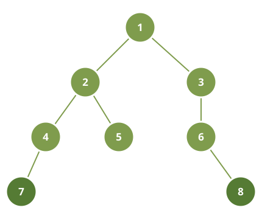

# Bottom-Level Leaf Sum

## Description

You are given the `root` of a binary tree. Among all of its leaves,
consider only the ones sitting on the final level — the level farther
from the root than any other leaf reaches. Report the total of those
nodes' values.

### Example 1



```text
Input: root = [1,2,3,4,5,null,6,7,null,null,null,null,8]
Output: 15
```

### Example 2

```text
Input: root = [2,7,1,null,8,null,4]
Output: 12
Explanation: The last level holds the two leaves 8 and 4, so their total
is 12.
```

### Constraints

- The number of nodes is between `1` and `10⁴`.
- `1 <= Node.val <= 100`

## Hints

### Hint 1

A first traversal of the tree tells you how many levels it has.

### Hint 2

On a second traversal, add a node's value only when the level it sits on
is the deepest one you measured.
