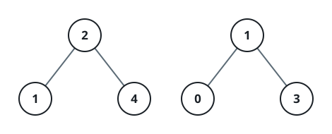

# Sorted Merge of Two Search Trees

## Description

You are given the roots of two binary search trees. Gather every value
stored across the two trees and return all of them in a single array
sorted from smallest to largest. Values that appear in both trees, or
twice in one tree, are reported once per occurrence.

### Example 1



```text
Input: root1 = [2,1,4], root2 = [1,0,3]
Output: [0,1,1,2,3,4]
```

### Example 2


```text
Input: root1 = [1,null,8], root2 = [8,1]
Output: [1,1,8,8]
```

### Constraints

- Each tree holds between `0` and `5000` nodes.
- `-10⁵ <= Node.val <= 10⁵`

## Hints

### Hint 1

An in-order walk of a search tree visits its values in ascending order;
drain each tree into its own list that way.

### Hint 2

With both lists sorted, one merge pass — repeatedly taking whichever
front element is smaller — produces the answer without re-sorting.
