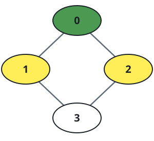
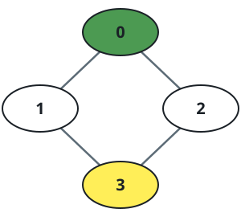

# Videos by Level-K Friends

## Description

A small social network has `n` people, each identified by a unique number
from `0` to `n - 1`. You are given `watchedVideos` and `friends`, where
`watchedVideos[i]` lists the videos person `i` has watched (possibly with
repeats) and `friends[i]` lists the people person `i` is directly connected
to. Friendships are mutual: if `j` appears in `friends[i]`, then `i`
appears in `friends[j]`.

Define the "level" of a person as their shortest-path distance from you
along friendship links: your direct friends sit at level 1, their other
friends at level 2, and so on. Given your own id and a level `k`, collect
every video watched by the level-`k` people and return the distinct video
names sorted by how often they were watched, ascending, breaking ties by
name in alphabetical order.

### Example 1



```text
Input: watchedVideos = [["A","B"],["C"],["B","C"],["D"]], friends = [[1,2],[0,3],[0,3],[1,2]], id = 0, level = 1
Output: ["B","C"]
Explanation: Person 0 (green) has two level-1 friends, persons 1 and 2
(yellow). Person 1 watched "C"; person 2 watched "B" and "C". Counting
across the two of them: "B" once, "C" twice, so "B" precedes "C".
```

### Example 2



```text
Input: watchedVideos = [["A","B"],["C"],["B","C"],["D"]], friends = [[1,2],[0,3],[0,3],[1,2]], id = 0, level = 2
Output: ["D"]
Explanation: The only person at shortest distance 2 from person 0 (green)
is person 3 (yellow), so only person 3's watched list contributes.
```

### Example 3

```text
Input: watchedVideos = [["a"],["b","b","c"],["a","c"],["d"],["b","d"],["a"]], friends = [[1,2],[0,3],[0,4],[1,5],[2,5],[3,4]], id = 0, level = 2
Output: ["b","d"]
Explanation: From person 0 the level-2 people are persons 3 and 4. Their
watched lists are ["d"] and ["b","d"], so "b" was watched once and "d"
twice — "b" first despite sorting after "d", because frequency comes first.
```

### Constraints

- `n == watchedVideos.length == friends.length`
- `2 <= n <= 100`
- `1 <= watchedVideos[i].length <= 100`
- `1 <= watchedVideos[i][j].length <= 8`
- `0 <= friends[i].length < n`
- `0 <= friends[i][j] < n`
- `0 <= id < n`
- `1 <= level < n`
- friendship is symmetric: if `j` is in `friends[i]`, then `i` is in `friends[j]`

## Hints

### Hint 1

A breadth-first search from your own id, stopped after `k` layers, visits
exactly the people whose shortest distance equals `k` — first discovery
always happens along a shortest path.

### Hint 2

Tally the watched lists of those level-`k` people with a frequency map,
then sort the distinct names by (count, name) ascending.
