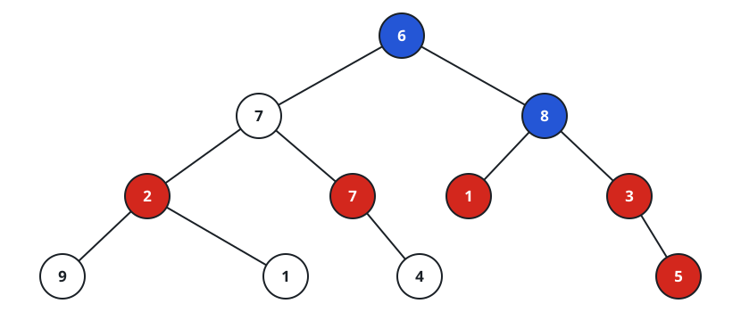

# Even Grandparent Sum

## Description

You are given the root of a binary tree whose nodes carry positive values.
A node's grandparent is its parent's parent, when that exists.

Return the sum of the values of every node whose grandparent exists and
holds an even value. If no node has an even-valued grandparent, the sum is 0.

### Example 1



```text
Input: root = [6,7,8,2,7,1,3,9,null,1,4,null,null,null,5]
Output: 18
Explanation: Blue marks the even-valued grandparents; red marks their
grandchildren. Adding the red nodes' values gives 18.
```

### Example 2


```text
Input: root = [1]
Output: 0
Explanation: A lone node has no grandparent at all, so nothing
contributes.
```

### Example 3

```text
Input: root = [2,4,9,1,3,null,7]
Output: 11
Explanation: The root's value 2 is even, so its four grandchildren — 1,
3, and 7 — count, and 1 + 3 + 7 = 11. Node 4 is also even, but it has no
grandchildren to reward.
```

### Example 4

```text
Input: root = [5,4,2,null,null,3]
Output: 0
Explanation: The only grandparent in the tree is the root, whose value 5
is odd, and node 4's even value never becomes a grandparent.
```

### Constraints

- the tree has between 1 and 10⁴ nodes
- `1 <= Node.val <= 100`

## Hints

### Hint 1

Walk the tree once, carrying each node's parent value and grandparent
value down with it.

### Hint 2

Whenever the carried grandparent value is even, add the current node's
value to the answer.
