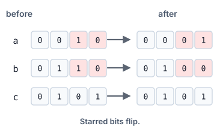

# Fewest Flips to Match an OR

## Description

You are given three positive integers `a`, `b`, and `c`. In one flip you
may change a single bit of either `a` or `b` — a `0` becomes a `1`, or a
`1` becomes a `0`.

Return the minimum number of flips needed so that the bitwise OR of the
two changed values equals `c`.

### Example 1



```text
Input: a = 2, b = 6, c = 5
Output: 3
Explanation: Flipping three bits yields a = 1 and b = 4, whose OR is 5.
```

### Example 2

```text
Input: a = 8, b = 3, c = 2
Output: 2
Explanation: In binary, bit 0 of b must fall (it would pollute the OR
with a 1 where c has 0) and bit 3 of a must fall as well.
```

### Example 3

```text
Input: a = 5, b = 5, c = 4
Output: 2
Explanation: Both numbers hold a 1 in bit 0 where c holds a 0, so each of
those two bits must be flipped off.
```

### Example 4

```text
Input: a = 7, b = 7, c = 1
Output: 4
Explanation: Bits 1 and 2 are set in both a and b but clear in c, and
each of the four set bits needs its own flip.
```

### Constraints

- `1 <= a <= 10⁹`
- `1 <= b <= 10⁹`
- `1 <= c <= 10⁹`

## Hints

### Hint 1

Work bit by bit: the two operands never interact within a single bit
position except through the OR of that position.

### Hint 2

Where c's bit is 1, one flip suffices only when both a and b hold 0
there; where c's bit is 0, every set bit among a and b at that position
must be flipped off.
