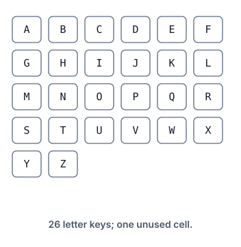

# Two-Finger Typing Cost

## Description



The figure above is a keyboard in the X-Y plane: the 26 uppercase letters
occupy a fixed grid of keys, six per row, filled A through Z left to right,
top to bottom. 'A' therefore sits at (0, 0), 'B' at (0, 1), 'P' at (2, 3),
and 'Z' at (4, 1).

You type the string `word` using two fingers. Each character is pressed by
one of the two fingers, and moving a finger from one key to another costs
the Manhattan distance between the two keys: for coordinates
(x1, y1) and (x2, y2) that distance is |x1 - x2| + |y1 - y2|. The first
press of each finger is free — its starting position costs nothing — so the
fingers do not need to begin on the word's first characters.

Return the smallest total cost that types the whole word.

### Example 1

```text
Input: word = "KEY"
Output: 1
Explanation: Finger 1 starts free on 'K' (cost 0), slides to 'E' for
distance 1, and finger 2 starts free on 'Y' (cost 0). The total is 1.
```

### Example 2

```text
Input: word = "BALLOON"
Output: 6
Explanation: Finger 1 types 'B' then 'A' at a cost of 1. Finger 2 starts
free on the first 'L', repeats it for free, moves to 'O' for distance 4,
stays for the second 'O', and ends on 'N' for distance 1, adding 5. The
total is 6.
```

### Example 3

```text
Input: word = "PASTEL"
Output: 9
Explanation: Finger 1 starts free on 'P' while finger 2 starts free on 'A'
and walks 'A' -> 'S' -> 'T' for 3 + 1 = 4; finger 1 then jumps 'P' -> 'E'
for 3 and 'E' -> 'L' for 2. The total is 9.
```

### Constraints

- `2 <= word.length <= 300`
- `word` consists of uppercase English letters.

## Hints

### Hint 1

After each press, only two facts matter: the letter under the finger that
just typed (that letter is forced by the prefix already typed) and where
the other finger rests. That tiny state space invites dynamic programming.

### Hint 2

Sweep the word once, keeping one cost per possible resting letter of the
idle finger; model a not-yet-used finger as an extra slot whose distance to
every key is 0. Each new character either advances the finger that just
typed or wakes the idle one, taking whichever is cheaper.
