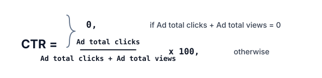

# Click-Through Rates

## Description

A media site sells ads in its newsletter and logs how readers react to
each placement. `Placements` holds one row per reader reaction: which
ad placement, which reader, and what the reader did with it.

Table: `Placements`

| Column Name  | Type |
| ------------ | ---- |
| placement_id | int  |
| viewer_id    | int  |
| reaction     | enum |

`(placement_id, viewer_id)` is the primary key (combination of columns
with unique values) for this table.
Each row records the id of an ad placement, the id of a viewer, and
the action that viewer took on it.
The `reaction` column is an ENUM (category) type of ('Clicked',
'Viewed', 'Ignored').

The site wants to gauge how well each ad performs.

An ad's performance is measured by its Click-Through Rate (CTR):

`ctr = (Clicked count) / (Clicked count + Viewed count) * 100`



Find the CTR of each ad, rounded to two decimal places.

Return the result rows ordered by `ctr` in descending order, breaking
ties by `placement_id` in ascending order.

The result format is shown in the following examples.

### Example 1

```text
Input:
Placements table:
+--------------+-----------+----------+
| placement_id | viewer_id | reaction |
+--------------+-----------+----------+
| 4            | 101       | Viewed   |
| 2            | 102       | Clicked  |
| 1            | 103       | Viewed   |
| 3            | 104       | Ignored  |
| 2            | 105       | Viewed   |
| 4            | 106       | Clicked  |
| 1            | 107       | Ignored  |
| 3            | 108       | Ignored  |
| 2            | 109       | Ignored  |
| 1            | 110       | Viewed   |
+--------------+-----------+----------+
Output:
+--------------+------+
| placement_id | ctr  |
+--------------+------+
| 2            | 50.0 |
| 4            | 50.0 |
| 1            | 0.0  |
| 3            | 0.0  |
+--------------+------+
Explanation:
For placement 2, ctr = (1/(1+1)) * 100 = 50.0.
For placement 4, ctr = (1/(1+1)) * 100 = 50.0; it ties placement 2,
so the smaller id comes first.
For placement 1, ctr = (0/(0+2)) * 100 = 0.0.
For placement 3, ctr = 0.0 — it drew no clicks and no views, only
ignored impressions.
Ignored reactions never enter the rate.
```

### Example 2

```text
Input:
Placements table:
+--------------+-----------+----------+
| placement_id | viewer_id | reaction |
+--------------+-----------+----------+
| 7            | 201       | Clicked  |
| 7            | 202       | Viewed   |
| 7            | 203       | Clicked  |
| 7            | 204       | Ignored  |
+--------------+-----------+----------+
Output:
+--------------+-------+
| placement_id | ctr   |
+--------------+-------+
| 7            | 66.67 |
+--------------+-------+
Explanation:
Placement 7 collected 2 clicks and 1 view, so ctr =
(2/(2+1)) * 100 = 66.67.
```

Write your solution as a single `SELECT` query returning
`placement_id` and `ctr`.
