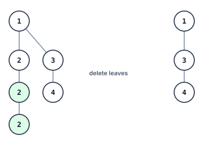
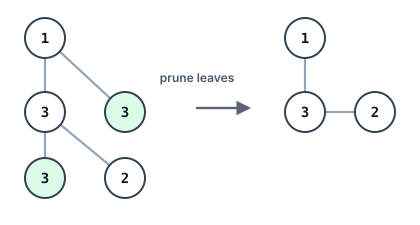
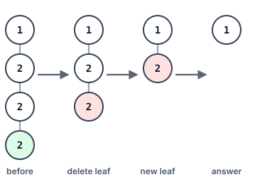

# Prune Target Leaves

## Description

You are given the `root` of a binary tree and an integer `target`. Strip
away every leaf whose value equals `target`, then keep going: losing a
leaf can turn its parent into a leaf, and that parent must be removed too
if it also carries `target`. Repeat until no remaining node is both a leaf
and equal to `target`, and return what is left of the tree.

### Example 1



```text
Input: root = [1,2,3,2,null,2,4], target = 2
Output: [1,null,3,null,4]
Explanation: The green 2-leaves in the left tree go first; deleting the
deeper one exposes the 2 above it as a fresh leaf, so that node is removed
as well, leaving the tree on the right.
```

### Example 2



```text
Input: root = [1,3,3,3,2], target = 3
Output: [1,3,null,null,2]
Explanation: Both green 3-leaves fall, but their parent 3 still has the 2
beneath it, so it is not a leaf and survives.
```

### Example 3



```text
Input: root = [1,2,null,2,null,2], target = 2
Output: [1]
Explanation: The chain of 2s peels away one node per step — every deletion
turns the 2 above it into the next leaf — until only the root, which does
not match target, remains.
```

### Constraints

- The tree holds between `1` and `3000` nodes.
- `1 <= Node.val, target <= 1000`

## Hints

### Hint 1

Settle children before parents: only once both subtrees of a node have
been pruned can the node itself be judged — it dies exactly when both
pruned children are gone and its own value equals `target`.

### Hint 2

A depth-first walk that returns each node's surviving (possibly empty)
subtree applies that judgment bottom-up in one pass; whatever it returns
for the root is the answer.
