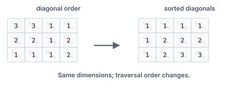

# Sort Each Diagonal

## Description

A diagonal of an `m x n` matrix `mat` is any chain of cells that starts on
the top row or the left edge and steps down-right until it leaves the
matrix. For instance, in a 6 x 3 matrix the diagonal beginning at
`mat[2][0]` covers `mat[2][0]`, `mat[3][1]`, and `mat[4][2]` — every later
step would fall off the bottom.

Sort every diagonal's values in ascending order and return the resulting
matrix. Values only move along their own diagonal; cells on different
diagonals never trade places.

### Example 1



```text
Input: mat = [[3,3,1,1],[2,2,1,2],[1,1,1,2]]
Output: [[1,1,1,1],[1,2,2,2],[1,2,3,3]]
```

### Example 2

```text
Input: mat = [[8,6,3,9],[5,7,1,4],[2,9,6,5]]
Output: [[6,1,3,9],[5,7,5,4],[2,9,8,6]]
Explanation: The main diagonal 8,7,6 becomes 6,7,8; the diagonal above it
6,1,5 becomes 1,5,6; the one below 5,9 becomes 5,9; the remaining short
diagonals 3,4, 9, and 2 are already sorted.
```

### Constraints

- `m == mat.length`
- `n == mat[i].length`
- `1 <= m, n <= 100`
- `1 <= mat[i][j] <= 100`

## Hints

### Hint 1

All cells of one diagonal share the same value of `i - j`, so that
difference names the diagonal.

### Hint 2

Collect each diagonal's values into its own bucket, sort the bucket, and
write the sorted values back along the same down-right walk.
