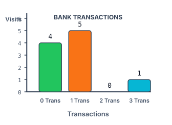

# Withdrawals per Check-In

## Description

Table: `Checkins`

| Column Name  | Type |
| ------------ | ---- |
| member_id    | int  |
| checkin_date | date |

`(member_id, checkin_date)` together identify a row — no member checks in
twice on the same day. Each row records that the member walked into the
savings branch on that date.

Table: `Withdrawals`

| Column Name | Type |
| ----------- | ---- |
| member_id   | int  |
| made_on     | date |
| amount      | int  |

Rows here may repeat freely: one row is one cash withdrawal of `amount`
made by the member on `made_on`. Every withdrawal is guaranteed to fall on
a day its member checked in, i.e. the matching `(member_id, made_on)` pair
always exists in `Checkins`.

The branch wants to chart how withdrawal activity spreads across visits:
for each possible number of withdrawals made during a single visit, how
many visits actually landed in that bucket?

Write a query that reports, for every count from 0 up to the largest
number of withdrawals made during one visit, how many check-ins involved
exactly that many withdrawals. The result has two columns:

- `withdrawals_count` — a withdrawal count for a single visit;
- `checkins_count` — how many visits saw exactly `withdrawals_count`
  withdrawals.

The first column must cover every value from 0 through the observed
maximum, including counts with an empty bucket, and the rows are ordered
by `withdrawals_count` ascending.

### Example 1



```text
Input:
Checkins table:
+-----------+--------------+
| member_id | checkin_date |
+-----------+--------------+
| 1         | 2020-01-01   |
| 2         | 2020-01-02   |
| 12        | 2020-01-01   |
| 19        | 2020-01-03   |
| 1         | 2020-01-02   |
| 2         | 2020-01-03   |
| 1         | 2020-01-04   |
| 7         | 2020-01-11   |
| 9         | 2020-01-25   |
| 8         | 2020-01-28   |
+-----------+--------------+
Withdrawals table:
+-----------+----------+--------+
| member_id | made_on  | amount |
+-----------+----------+--------+
| 1         | 2020-01-02 | 120  |
| 2         | 2020-01-03 | 22   |
| 7         | 2020-01-11 | 232  |
| 1         | 2020-01-04 | 7    |
| 9         | 2020-01-25 | 33   |
| 9         | 2020-01-25 | 66   |
| 8         | 2020-01-28 | 1    |
| 9         | 2020-01-25 | 99   |
+-----------+----------+--------+
Output:
+--------------------+----------------+
| withdrawals_count  | checkins_count |
+--------------------+----------------+
| 0                  | 4              |
| 1                  | 5              |
| 2                  | 0              |
| 3                  | 1              |
+--------------------+----------------+
Explanation: Four visits — member 1 on 2020-01-01, member 2 on
2020-01-02, member 12 on 2020-01-01 and member 19 on 2020-01-03 — ended
without a single withdrawal. Five visits saw exactly one withdrawal each.
No visit saw exactly two, so that bucket holds 0. Member 9's visit on
2020-01-25 is the only one with three withdrawals. No visit exceeded
three, so the report stops there.
```
