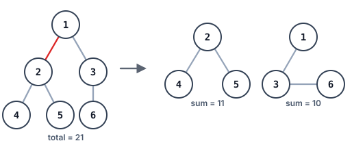
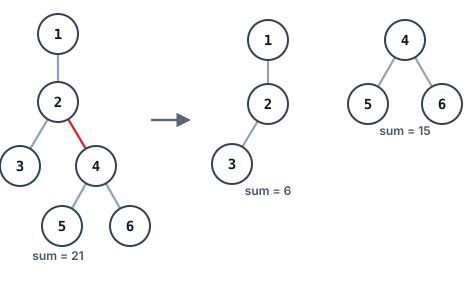

# Two-Part Tree Product

## Description

You are given the `root` of a binary tree whose node values are all
positive. Removing exactly one edge cuts the tree into two connected
pieces: the piece hanging below the cut, and everything left holding the
root.

Score each possible cut by multiplying the sums of the two pieces
together. Evaluate every edge this way and report the largest product
seen, reduced modulo `10^9 + 7`.

The comparison itself must use the full-precision products — the modulo
is applied only to the winning value at the very end, never while
choosing it.

### Example 1



```text
Input: root = [1,2,3,4,5,6]
Output: 110
Explanation: Severing the marked red edge leaves one piece summing to 11
and the other to 10, and 11 * 10 = 110 beats every other cut.
```

### Example 2



```text
Input: root = [1,null,2,3,4,null,null,5,6]
Output: 90
Explanation: Severing the marked red edge separates a piece of sum 15
from one of sum 6, and 15 * 6 = 90.
```

### Constraints

- The tree holds between `2` and `5 * 10⁴` nodes.
- `1 <= Node.val <= 10⁴`

## Hints

### Hint 1

A single post-order sweep hands you every subtree's sum plus the grand
total. The cut immediately above any non-root node `v` then scores
`sum(v) * (total - sum(v))`, so the answer is simply the largest such
value across the tree.
