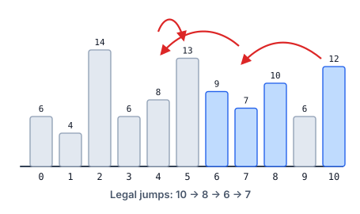

# Downhill Hop Chain V

## Description

You are given an integer array `arr` and an integer `d`. One hop moves
from index `i` to either `i + x` or `i - x`, where `0 < x <= d` and the
landing index stays inside the array.

A hop from `i` onto `j` is legal only when `arr[i] > arr[j]` and every
index strictly between the two carries a value smaller than `arr[i]` —
any equal or taller value in between acts as a wall that the hop cannot
cross.

Choose any starting index and hop repeatedly. Return the largest number
of distinct indices a single chain of hops can visit.

### Example 1



```text
Input: arr = [6,4,14,6,8,13,9,7,10,6,12], d = 2
Output: 4
Explanation: Beginning at index 10, the chain hops 10 -> 8 -> 6 -> 7,
each landing strictly lower with no taller index crossed along the way —
four indices in total. From index 6 only index 7 is reachable, because
the 13 at index 5 walls off every hop farther left.
```

### Example 2

```text
Input: arr = [8,4,8,4,8], d = 3
Output: 2
Explanation: An 8 can drop onto a neighbouring 4 and no farther —
hopping between 4s is never legal, and the intervening 8s wall off the
longer reaches — so two indices is the ceiling.
```

### Example 3

```text
Input: arr = [13,12,11,10,9], d = 2
Output: 5
Explanation: The values fall strictly from left to right, so starting
at index 0 the chain keeps stepping down and covers all five indices.
```

### Constraints

- `1 <= arr.length <= 1000`
- `1 <= arr[i] <= 10⁵`
- `1 <= d <= arr.length`

## Hints

### Hint 1

Frame the work per starting index: let the table entry at `i` hold the
longest chain that begins there, and the answer is the largest entry.
Every legal hop lands on a strictly smaller value, and that strict drop
fixes an order in which the entries can be settled for good.

### Hint 2

To fill in index `i`, walk outward right and then left at most `d`
steps, stopping at the first index whose value is not below `arr[i]` —
that wall ends every further reach in that direction. The entry is one
plus the best entry among the reachable landings.
