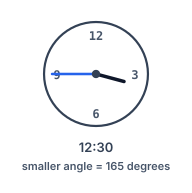
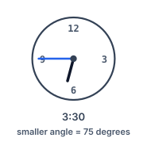
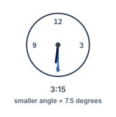

# Clock Hand Spread

## Description

An analog clock reads `hour` and `minutes`. Measure the angle between
the hour hand and the minute hand, and return the smaller of the two
angles they form, in degrees.

An answer within `10^-5` of the exact value counts as correct.

### Example 1



```text
Input: hour = 12, minutes = 30
Output: 165
Explanation: Half past twelve puts the minute hand on the 6 while the
hour hand has crept halfway toward the 1; the smaller gap between the
hands is 165 degrees.
```

### Example 2



```text
Input: hour = 3, minutes = 30
Output: 75
Explanation: The minute hand rests on the 6, and the hour hand has
drifted halfway from the 3 toward the 4 — a spread of 75 degrees.
```

### Example 3



```text
Input: hour = 3, minutes = 15
Output: 7.5
Explanation: Every minute nudges the hour hand half a degree onward, so
fifteen minutes past three leaves it 7.5 degrees ahead of the 3 where
the minute hand points.
```

### Constraints

- `1 <= hour <= 12`
- `0 <= minutes <= 59`

## Hints

### Hint 1

Placing the minute hand is easy — six degrees for every minute. The
subtle part is that the hour hand never waits at the hour mark: it
creeps forward half a degree per minute.

### Hint 2

Convert each hand to degrees measured from twelve o'clock, subtract the
two positions, and remember that a pair of hands always frames two
angles totaling 360 degrees — return whichever is smaller.
