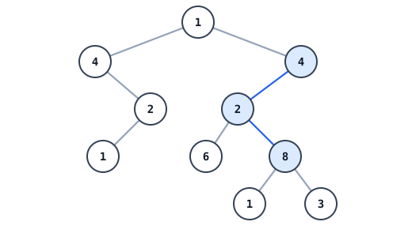
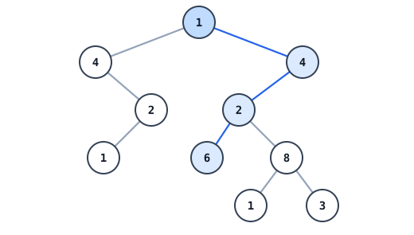

# List Path Hiding in a Binary Tree

## Description

You are given the root of a binary tree and the head of a linked list. Decide
whether the list's values, read from `head` onward, trace out a downward path
somewhere in the tree: the path may begin at any node and always moves from a
node to one of its children. Answer `true` when some downward path spells the
whole list, `false` otherwise.

### Example 1



```text
Input: head = [4,2,8], root = [1,4,4,null,2,2,null,1,null,6,8,null,null,null,null,1,3]
Output: true
Explanation: The deepest level hides the list — the branch 4 -> 2 -> 8 runs
straight down the right-hand subtree.
```

### Example 2



```text
Input: head = [1,4,2,6], root = [1,4,4,null,2,2,null,1,null,6,8,null,null,null,null,1,3]
Output: true
Explanation: Starting at the root, the downward path 1 -> 4 -> 2 -> 6 exists
in the tree.
```

### Example 3

```text
Input: head = [2,1,3], root = [2,2,3,null,1,null,3]
Output: false
Explanation: Both 2 -> 1 and 2 -> 2 -> 1 appear, but no single downward path
carries the entire list 2 -> 1 -> 3.
```

### Constraints

- The tree contains between `1` and `2500` nodes.
- The list contains between `1` and `100` nodes.
- Every node value, in both structures, satisfies `1 <= Node.val <= 100`.

## Hints

### Hint 1

Write a helper that takes a list position and a tree node and reports whether
the remainder of the list continues downward from that node.

### Hint 2

A match may start anywhere, so give every tree node a chance to be the first
list element and let the helper handle the rest.
