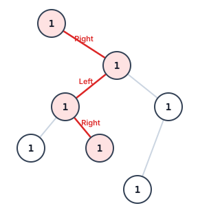
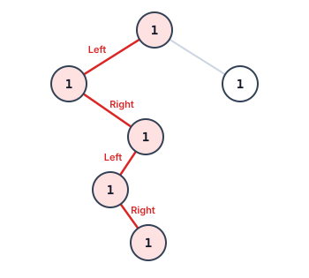

# Longest Switchback Path in a Binary Tree

## Description

You are given the `root` of a binary tree. A switchback path wanders down the
tree while insisting on turning every step:

1. Pick any starting node and any first direction, left or right.
2. Move to the child on the chosen direction.
3. Flip the direction.
4. Repeat steps 2-3 for as long as the required child exists.

The path stops the moment the next move would need a child that is missing.
Its length is the number of nodes visited minus one — lingering on a single
node counts as zero.

Report the length of the longest switchback path anywhere in the tree.

### Example 1



```text
Input: root = [1,null,1,1,1,null,null,1,1,null,1,null,null,null,1]
Output: 3
Explanation: The longest switchback path steps right -> left -> right.
```

### Example 2



```text
Input: root = [1,1,1,null,1,null,null,1,1,null,1]
Output: 4
Explanation: The longest switchback path steps left -> right -> left ->
right.
```

### Example 3

```text
Input: root = [1,null,1,null,1,null,1]
Output: 1
Explanation: A straight chain never turns, so any path dies after its first
step and the best achievable length is 1.
```

### Constraints

- The tree holds between `1` and `5 * 10^4` nodes.
- Every node value satisfies `1 <= Node.val <= 100`.

## Hints

### Hint 1

Think in terms of a helper `longest(node, direction)`: the length of the
switchback that arrives at `node` traveling in `direction` and must next
step the other way.

### Hint 2

Those two numbers per node are computable bottom-up: a node's move into its
left child extends that child's arrived-moving-right run, and vice versa.
The answer is the largest value ever seen.
