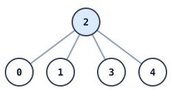

# Spreading News Through the Ranks

## Description

A company staffs `n` employees, each holding a unique id from `0` to `n - 1`.
One of them, `headID`, sits at the top of the org chart. Every other employee
reports to exactly one direct manager: `manager[i]` is the manager of
employee `i`, and `manager[headID] = -1` marks the head. The reporting lines
are guaranteed to form a tree.

An urgent announcement starts at the head. As soon as an employee learns the
news, that employee begins telling their own direct reports, and the process
continues down the tree until everyone has heard it. Telling all of one's
direct reports takes employee `i` exactly `informTime[i]` minutes; only after
that do those reports start passing the news on.

Return the total number of minutes from the moment the head learns the news
until the last employee in the company knows it.

### Example 1

```text
Input: n = 4, headID = 0, manager = [-1,0,1,2], informTime = [1,2,3,0]
Output: 6
Explanation: The org chart is a single chain: 0 manages 1, 1 manages 2, and
2 manages 3. The news reaches employee 1 after 1 minute, employee 2 after
1 + 2 = 3 minutes, and employee 3 after 3 + 3 = 6 minutes.
```

### Example 2



```text
Input: n = 6, headID = 2, manager = [2,2,-1,2,2,2], informTime = [0,0,1,0,0,0]
Output: 1
Explanation: The head of the company with id = 2 directly manages all the
other employees and needs 1 minute to tell them, so everyone is informed
after 1 minute.
```

### Constraints

- `1 <= n <= 10^5`
- `0 <= headID < n`
- `manager.length == n`
- `0 <= manager[i] < n`
- `manager[headID] == -1`
- `informTime.length == n`
- `0 <= informTime[i] <= 1000`
- Employee `i` has `informTime[i] == 0` exactly when they manage nobody.
- The reporting lines form a tree, so every employee eventually hears the
  news.

## Hints

### Hint 1

The reporting lines are a tree rooted at the head. An employee starts
spreading the news at the moment they hear it plus their own inform time.

### Hint 2

The answer is the largest chain of delays from the head down to any employee
— the sum of inform times along the heaviest root-to-leaf path.
