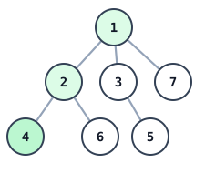
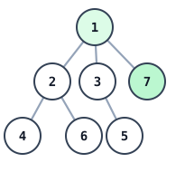

# Frog Landing Odds

## Description

An undirected tree has `n` vertices numbered `1` to `n`. A frog sits on
vertex `1` and hops once per second. Each second it moves along an edge to
one of the adjacent vertices it has never occupied before — it never returns
to a visited vertex. If several unvisited neighbors are available, it picks
one of them uniformly at random; if none are, it stays on its current vertex
forever.

The tree's edges are given as `edges`, where `edges[i] = [ai, bi]` means `ai`
and `bi` are connected.

Return the probability that the frog is sitting on vertex `target` after
exactly `t` seconds. Answers within `10^-5` of the true probability are
accepted.

### Example 1



```text
Input: n = 7, edges = [[1,2],[1,3],[1,7],[2,4],[2,6],[3,5]], t = 2, target = 4
Output: 0.16666666666666666
Explanation: From vertex 1 the frog has 3 unvisited neighbors, so it reaches
vertex 2 after second 1 with probability 1/3. From vertex 2 it then chooses
between vertices 4 and 6, reaching vertex 4 after second 2 with probability
1/2. Overall the chance of resting on vertex 4 is 1/3 * 1/2 = 1/6 =
0.16666666666666666.
```

### Example 2



```text
Input: n = 7, edges = [[1,2],[1,3],[1,7],[2,4],[2,6],[3,5]], t = 1, target = 7
Output: 0.3333333333333333
Explanation: After one hop the frog rests on vertex 7 with probability
1/3 = 0.3333333333333333.
```

### Constraints

- `1 <= n <= 100`
- `edges.length == n - 1`
- `edges[i].length == 2`
- `1 <= ai, bi <= n`
- `1 <= t <= 50`
- `1 <= target <= n`

## Hints

### Hint 1

Walk the tree away from vertex 1, carrying (current vertex, current time);
each unvisited neighbor splits the current probability equally.

### Hint 2

A non-zero answer needs either arrival at `target` exactly at second `t`, or
an earlier arrival on a `target` that has no way onward — then the frog is
stuck there and stays put.
