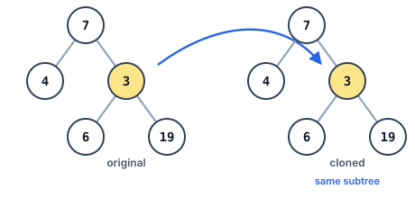
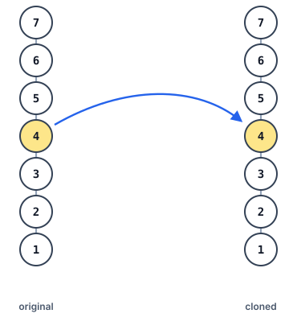

# Counterpart Node in the Copied Tree

## Description

You are given a binary tree and a second tree that is an exact copy of it —
same shape, same values, every node duplicated. You are also given one
distinguished node of the original tree.

Locate the node that sits in the same position of the copied tree: the copy
that was cloned from the distinguished node. Report that cloned node.

Node references cannot cross the judge boundary, so this version passes the
distinguished node by value: `target` is the value stored at that node, all
values in the tree are distinct, and the answer is reported as the subtree of
the copied tree rooted at the counterpart node (serialized in level order).
Neither tree may be modified.

### Example 1



```text
Input: tree = [7,4,3,null,null,6,19], target = 3
Output: [3,6,19]
Explanation: The counterpart of the node holding value 3 is the root of the
subtree shown — the copied tree's node holding 3 together with everything
below it.
```

### Example 2


```text
Input: tree = [7], target = 7
Output: [7]
Explanation: With a single node, the counterpart is the copied tree's lone
node itself.
```

### Example 3



```text
Input: tree = [8,null,6,null,5,null,4,null,3,null,2,null,1], target = 4
Output: [4,null,3,null,2,null,1]
Explanation: The node holding 4 lies on the tree's leftmost spine; its
counterpart heads the matching chain of descendants in the copy.
```

### Constraints

- The tree holds between `1` and `10^4` nodes.
- All node values are distinct.
- `target` is the value of some node of the original tree.

### Follow up

How would you cope if the tree were allowed to contain repeated values?

## Hints

### Hint 1

Walk both trees in lockstep; whenever the walk of the original reaches the
target value, the walk of the copy is standing on the answer.
