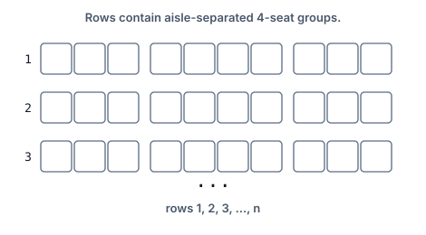
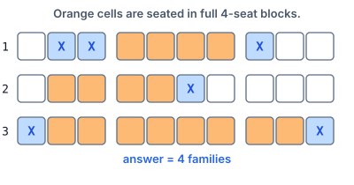

# Theater Party Seating

## Description



An auditorium has `n` rows of ten seats each, and within a row the seats are
numbered 1 through 10.

Some seats are already spoken for: `reservedSeats[i] = [rowi, seati]` marks
seat `seati` in row `rowi` as taken.

You are seating parties of four. A party occupies four seats of a single row,
and the only seat runs a party may take are:

- seats 2, 3, 4, 5
- seats 4, 5, 6, 7
- seats 6, 7, 8, 9

A run works only when all four of its seats are still open, and no seat may
be shared by two parties.

Report the largest number of parties that can be seated.

### Example 1



```text
Input: n = 3, reservedSeats = [[1,2],[1,3],[1,8],[2,6],[3,1],[3,10]]
Output: 4
Explanation: The taken seats leave one free run in each of rows 1 and 2 and
both runs of row 3 open, so four parties fit and no fifth run remains.
```

### Example 2

```text
Input: n = 5, reservedSeats = [[5,4],[5,7],[3,1],[3,10]]
Output: 8
Explanation: Row 5 can host nothing since seats 4 and 7 cut through all
three runs, row 3 keeps both of its runs free, and each of the three
untouched rows seats two parties.
```

### Example 3

```text
Input: n = 8, reservedSeats = [[2,5],[2,6],[8,9]]
Output: 13
Explanation: Seats 5 and 6 spoil every run of row 2, row 8 still fits the
left run around seat 9, and the six untouched rows contribute twelve more.
```

### Constraints

- `1 <= n <= 10⁹`
- `1 <= reservedSeats.length <= min(10 * n, 10^4)`
- `reservedSeats[i] == [rowi, seati]`
- `1 <= rowi <= n`
- `1 <= seati <= 10`
- All entries of `reservedSeats` are distinct.

## Hints

### Hint 1

A single row never holds more than two parties, because the three allowed
runs overlap heavily.

### Hint 2

For each row that appears in the input, test what fits from two parties down
to none.

### Hint 3

Rows never mentioned in `reservedSeats` are always good for two parties, so
only the touched rows need real work.
