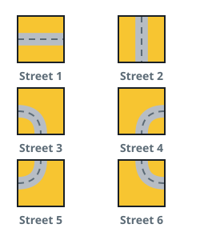
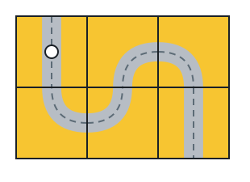
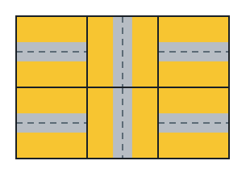

# Street Tiles To The Far Corner

## Description

Every cell of an `m x n` grid holds one street tile, coded by the pair of
sides it joins:

- `1` joins the left and right sides.
- `2` joins the top and bottom sides.
- `3` joins the left and bottom sides.
- `4` joins the right and bottom sides.
- `5` joins the left and top sides.
- `6` joins the right and top sides.



A walk begins on the tile at the upper-left corner `(0, 0)`. The walk may
step from a cell to an orthogonal neighbour only when the two tiles both
open toward their shared side, and it succeeds when it arrives at the
lower-right cell `(m - 1, n - 1)`.

Tiles are fixed — no tile may be rotated or replaced.

Report whether some walk can reach the lower-right corner.

### Example 1



```text
Input: grid = [[2,4,3],[6,5,2]]
Output: true
Explanation: Following the joined sides leads through every cell of the
grid and ends at (m - 1, n - 1).
```

### Example 2



```text
Input: grid = [[1,2,1],[1,2,1]]
Output: false
Explanation: The tile at (0, 0) joins no side shared with a neighbour, so
the walk is trapped there from the start.
```

### Example 3

```text
Input: grid = [[4,1],[6,1]]
Output: true
Explanation: The start tile opens downward to (1, 0), whose right side
meets the bottom-right tile's left side.
```

### Constraints

- `m == grid.length`
- `n == grid[i].length`
- `1 <= m, n <= 300`
- `1 <= grid[i][j] <= 6`

## Hints

### Hint 1

Treat two neighbouring tiles as connected exactly when each opens toward
their shared side, then flood out from `(0, 0)`.

### Hint 2

Wherever the flood stalls, the walk succeeds only if the stalled set
contains `(m - 1, n - 1)`.
