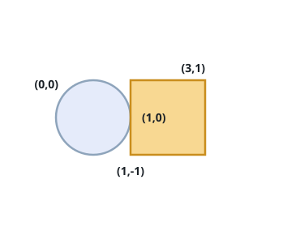
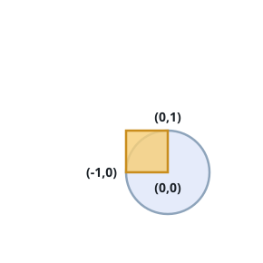

# Circle and Box Contact

## Description

A circle is described by its `radius` and the coordinates of its center,
`(xCenter, yCenter)`. An axis-aligned box is described by its bottom-left
corner `(x1, y1)` and its top-right corner `(x2, y2)`.

Decide whether the circle and the box share at least one point: return
`true` if some point of the plane lies both on or inside the circle and
on or inside the box, and `false` otherwise.

### Example 1



```text
Input: radius = 1, xCenter = 0, yCenter = 0, x1 = 1, y1 = -1, x2 = 3, y2 = 1
Output: true
Explanation: The box's left edge runs through the point (1,0), which
sits exactly one unit from the center — right on the circle's rim.
```

### Example 2

```text
Input: radius = 1, xCenter = 6, yCenter = 6, x1 = 2, y1 = 2, x2 = 4, y2 = 4
Output: false
Explanation: The closest point of the box to the center is the corner
(4,4), about 2.83 units away — farther than the circle ever reaches.
```

### Example 3



```text
Input: radius = 1, xCenter = 0, yCenter = 0, x1 = -1, y1 = 0, x2 = 0, y2 = 1
Output: true
```

### Constraints

- `1 <= radius <= 2000`
- `-10⁴ <= xCenter, yCenter <= 10⁴`
- `-10⁴ <= x1 < x2 <= 10⁴`
- `-10⁴ <= y1 < y2 <= 10⁴`

## Hints

### Hint 1

Rather than hunting for a shared point, compute the point of the box
that lies closest to the circle's center: clamping the center's x into
`[x1, x2]` and its y into `[y1, y2]` produces it directly.

### Hint 2

The two shapes touch exactly when that nearest point is at most `radius`
away from the center; compare squared distances so every step stays in
exact integer arithmetic.
