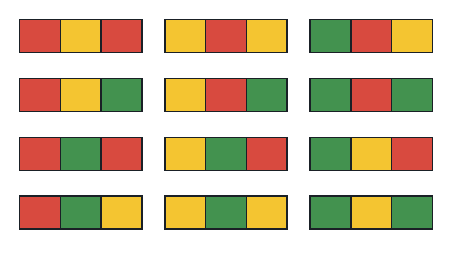

# Ways to Color a 3-Column Grid

## Description

You are painting a grid that is `n` rows tall and 3 columns wide. Each
cell gets exactly one of three paints — red, yellow, or green — and any
two cells sharing an edge, side by side in a row or stacked in a
column, must end up with different paints.

Count the distinct finished grids. Two colorings count separately
whenever any cell differs, and the count is reported modulo `10⁹ + 7`.

### Example 1



```text
Input: n = 1
Output: 12
Explanation: A single row of three cells has 12 valid paintings; the
figure lays out all of them.
```

### Example 2

```text
Input: n = 7
Output: 106494
```

### Example 3

```text
Input: n = 100
Output: 905790447
```

### Constraints

- `1 <= n <= 5000`

## Hints

### Hint 1

Work row by row with dynamic programming: a row only has to be
compatible with the row directly above it, so try every legal pattern
for each new row.

### Hint 2

Keep the state as the colors of the previous row's three cells —
`dp[i][c1][c2][c3]` = number of ways to paint rows `i` through `n-1`
given that row `i-1` uses colors `c1, c2, c3`. Fill that table from
top to bottom and the answer falls out.
