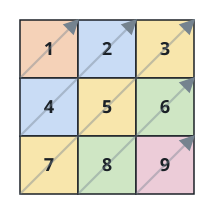

# Ragged Diagonal Sweep II

## Description

You are given a grid `nums` whose rows may have different lengths — a
cell exists at `(i, j)` only when row `i` is long enough to hold it.
Return every value of the grid as a single list, taken in this order:
walk the anti-diagonals one by one, starting with the corner cell and
moving to diagonals of increasing `i + j`, and along each anti-diagonal
climb from its lowest existing cell up to its highest.

The figures below trace the walk for both examples: cells are visited in
the numbered sweep shown.

### Example 1



```text
Input: nums = [[1,2,3],[4,5,6],[7,8,9]]
Output: [1,4,2,7,5,3,8,6,9]
```

### Example 2


```text
Input: nums = [[1,2,3,4,5],[6,7],[8],[9,10,11],[12,13,14,15,16]]
Output: [1,6,2,8,7,3,9,4,12,10,5,13,11,14,15,16]
```

### Example 3

```text
Input: nums = [[6,8],[2],[9,1,4]]
Output: [6,2,8,9,1,4]
Explanation: The anti-diagonal `i + j = 1` holds 8 above 2, so it is
emitted bottom-up as 2, 8. Row 1 contributes nothing to later
anti-diagonals because it is only one cell long.
```

### Constraints

- `1 <= nums.length <= 10⁵`
- `1 <= nums[i].length <= 10⁵`
- `1 <= sum(nums[i].length) <= 10⁵`
- `1 <= nums[i][j] <= 10⁵`

## Hints

### Hint 1

Two cells sit on the same anti-diagonal exactly when `i + j` is equal,
so that sum is the natural group key.

### Hint 2

Bucket each value under its `i + j` while scanning rows top-down. Each
bucket then already lists its cells top-down, so reading every bucket in
reverse — buckets ordered by key — produces the climb from the bottom.
