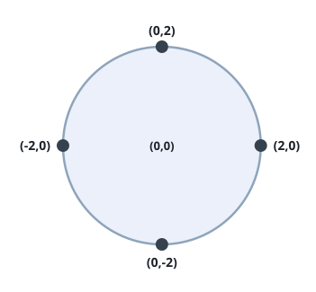
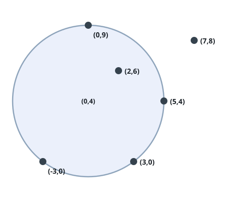

# Most Darts on One Board

## Description

Alice hurls `n` darts at a very large wall, and `darts[i] = [xi, yi]`
records where the `i`th dart stuck. Bob sees every landing spot and may
choose where to hang one circular dartboard of radius `r`.

A dart counts as on the board when its position falls inside the circle
or exactly on its rim. Given `r`, return the largest number of darts a
single placement of the board can gather.

### Example 1



```text
Input: darts = [[-2,0],[2,0],[0,2],[0,-2]], r = 2
Output: 4
Explanation: A board centered at the origin with radius 2 reaches all
four darts at once.
```

### Example 2



```text
Input: darts = [[-3,0],[3,0],[2,6],[5,4],[0,9],[7,8]], r = 5
Output: 5
Explanation: Centered at (0,4) with radius 5, the board catches every
dart except (7,8).
```

### Example 3

```text
Input: darts = [[0,0],[6,0],[3,4]], r = 3
Output: 2
Explanation: A board centered at (3,0) puts (0,0) and (6,0) exactly on
its rim, while (3,4) sits 4 units from that center — and no placement
gathers all three.
```

### Constraints

- `1 <= darts.length <= 100`
- `darts[i].length == 2`
- `-10⁴ <= xi, yi <= 10⁴`
- All the darts are unique
- `1 <= r <= 5000`

## Hints

### Hint 1

An optimal board can always be nudged until two darts rest exactly on its
rim (unless it only needs to cover a single dart).

### Hint 2

For a fixed radius, the centers of all circles through two given points
are easy to write down — there are 0, 1 or 2 of them.

### Hint 3

Enumerate every pair of darts, build those candidate centers, and count
how many darts each candidate covers.
