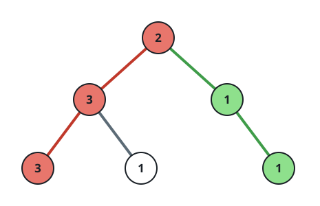
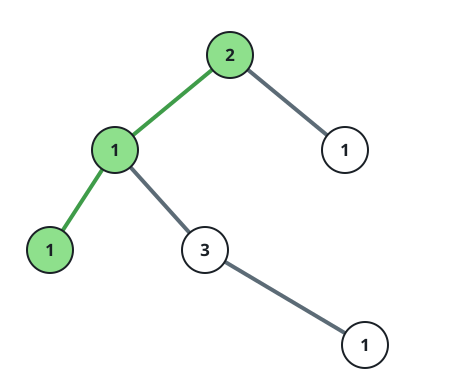

# Paths That Can Form a Palindrome

## Description

Every node in a binary tree holds a digit from 1 to 9. Walk from the root
down to a leaf and write out the digits you pass: the path can form a
palindrome when those digits admit at least one arrangement that reads
the same forwards and backwards.

Count the root-to-leaf paths with that property.

### Example 1



```text
Input: root = [2,3,1,3,1,null,1]
Output: 2
Explanation: The tree in the figure has three root-to-leaf paths: the
red one [2,3,3], the green one [2,1,1], and [2,3,1]. The red path
rearranges to [3,2,3] and the green one to [1,2,1], both palindromes,
while [2,3,1] has no palindromic arrangement — so the answer is 2.
```

### Example 2



```text
Input: root = [2,1,1,1,3,null,null,null,null,null,1]
Output: 1
Explanation: The figure's tree again yields three paths: the green
[2,1,1] together with [2,1,3,1] and [2,1]. Only [2,1,1] rearranges into
a palindrome, [1,2,1], so the answer is 1.
```

### Example 3

```text
Input: root = [5,5,null,6,null,6]
Output: 1
Explanation: The only root-to-leaf path is [5,5,6,6], whose values
rearrange into the palindrome [5,6,6,5].
```

### Constraints

- The number of nodes in the tree is in the range `[1, 10⁵]`.
- `1 <= Node.val <= 9`

## Hints

### Hint 1

A sequence of digits can be arranged into a palindrome exactly when at
most one digit occurs an odd number of times.

### Hint 2

Run a depth-first search carrying the odd/even parity of every digit's
count; on reaching a leaf, at most one odd parity means the path
qualifies.
