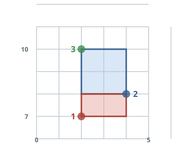

# Rectangles Spanned By Markers

## Description

A plotting tool records marked points on a grid. Any two of those
markers span an axis-aligned rectangle whose opposite corners sit on
the markers; only rectangles with a nonzero area count.

Table: `Markers`

| Column Name | Type |
| ----------- | ---- |
| id          | int  |
| x           | int  |
| y           | int  |

`id` is the column of unique values for this table, and each row holds
one marker's coordinates `(x, y)`.

Report every distinct rectangle with nonzero area formed by a pair of
markers. Each result row carries three columns:

- `first_id` and `second_id` are the ids of the two markers at opposite
  corners. Each pair is reported once, with `first_id < second_id`.
- `area` is the rectangle's area, and it must be nonzero.

Each testcase's `dataset` seeds the table: its script inserts the
testcase's `Markers` rows before your query runs. Return the result
table ordered by `area` in descending order; break ties by `first_id`
ascending, then by `second_id` ascending. The result format is in the
following example.

### Example 1



```text
Input:
Markers
+----+---+----+
| id | x | y  |
+----+---+----+
| 1  | 2 | 7  |
| 2  | 4 | 8  |
| 3  | 2 | 10 |
+----+---+----+
Output:
+-----------+-----------+------+
| first_id  | second_id | area |
+-----------+-----------+------+
| 2         | 3         | 4    |
| 1         | 2         | 2    |
+-----------+-----------+------+
Explanation: The markers with ids 2 and 3 sit at (4, 8) and (2, 10);
their rectangle spans |4 - 2| = 2 horizontally and |8 - 10| = 2
vertically, an area of 4. The markers with ids 1 and 2 span
|2 - 4| * |7 - 8| = 2. The pair 1 and 3 is not reported at all: both
markers share x = 2, so the rectangle they span is a flat segment of
area 0.
```

Write your solution as a single `SELECT` query returning three columns
— `first_id`, `second_id` and `area`.

## Hints

### Hint 1

Every unordered pair of markers is one candidate rectangle: a self
join with `a.id < b.id` produces each pair exactly once, smaller id
first.

### Hint 2

The area is `ABS(a.x - b.x) * ABS(a.y - b.y)`; keeping only rows where
that product is nonzero (equivalently: both differences nonzero) drops
the flat, degenerate pairs.

### Hint 3

The ordering is a three-key sort: `area` descending, then `first_id`
and `second_id` ascending.
