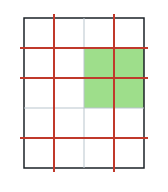
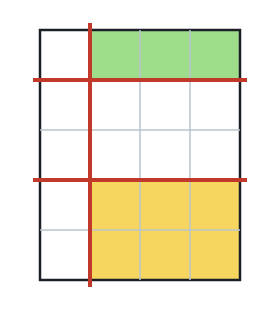

# Largest Slice After Cutting

## Description

You have a rectangular cake measuring `h x w`, along with two integer
arrays `horizontalCuts` and `verticalCuts`:

- `horizontalCuts[i]` is the distance from the cake's top edge to the
  ith horizontal cut, and
- `verticalCuts[j]` is the distance from its left edge to the jth
  vertical cut.

Every position in both arrays is cut straight across the whole cake.
Return the area of the largest slice that remains, reduced modulo
`10⁹ + 7` since the true value can be enormous.

### Example 1



```text
Input: h = 5, w = 4, horizontalCuts = [1,2,4], verticalCuts = [1,3]
Output: 4
Explanation: The figure above shows the cake after cutting; red lines
mark the cuts, and the green slice is the largest piece left.
```

### Example 2



```text
Input: h = 5, w = 4, horizontalCuts = [3,1], verticalCuts = [1]
Output: 6
Explanation: The figure above shows the cake after cutting; here the
green and yellow slices tie for the largest piece.
```

### Example 3

```text
Input: h = 7, w = 6, horizontalCuts = [4,1], verticalCuts = [3,5]
Output: 9
```

### Constraints

- `2 <= h, w <= 10⁹`
- `1 <= horizontalCuts.length <= min(h - 1, 10⁵)`
- `1 <= verticalCuts.length <= min(w - 1, 10⁵)`
- `1 <= horizontalCuts[i] < h`
- `1 <= verticalCuts[j] < w`
- All positions in `horizontalCuts` are distinct.
- All positions in `verticalCuts` are distinct.

## Hints

### Hint 1

Each cut runs the full width or full height, so every slice is one
horizontal strip crossing one vertical strip — the two directions can
be maximized independently.

### Hint 2

Sort each cut array, adjoin the cake's own edges `0` and `h` (or `w`),
and take the largest neighboring gap per direction; the answer is the
product of those two gaps modulo `10⁹ + 7`.
