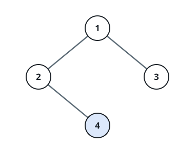
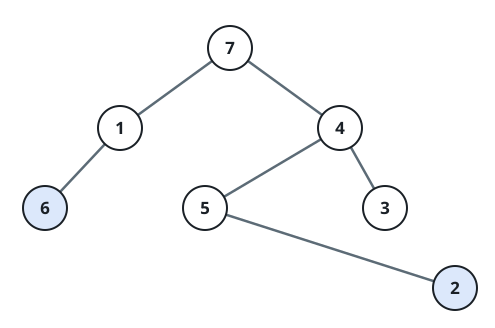
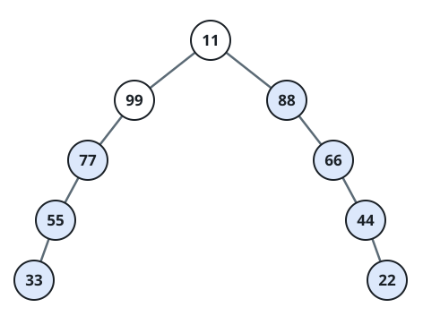

# Only Children In The Tree

## Description

In a binary tree, call a node an only child when it is the single child
of its parent — the parent's other child slot is empty. The root never
qualifies, since it has no parent at all.

Given the `root` of a binary tree, gather the values of every only
child in the tree and return them in any order.

### Example 1



```text
Input: root = [1,2,3,null,4]
Output: [4]
Explanation: The light blue node is the tree's lone only child. Node 1
is the root, so it cannot be an only child, and nodes 2 and 3 share a
parent, so neither is one either.
```

### Example 2



```text
Input: root = [7,1,4,6,null,5,3,null,null,null,null,null,2]
Output: [6,2]
Explanation: The light blue nodes are the only children. Order does not
matter — [2,6] is an equally acceptable answer.
```

### Example 3



```text
Input: root = [11,99,88,77,null,null,66,55,null,null,44,33,null,null,22]
Output: [77,55,33,66,44,22]
Explanation: Nodes 99 and 88 share a parent, and node 11 is the root;
every other node in the tree is an only child.
```

### Constraints

- The tree holds between 1 and 1000 nodes.
- `1 <= Node.val <= 10⁶`

## Hints

### Hint 1

A single traversal is enough: while visiting each node, check whether
exactly one of its two child slots is filled, and record that child's
value when it is.
