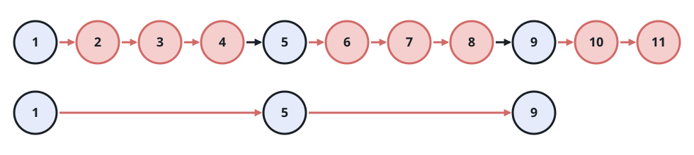

# Prune a Linked List in Keep-Drop Cycles

## Description

You are given the head of a linked list together with two integers `m`
and `n`. Sweep the list once, applying the same two-phase cycle from the
current position until the list runs out:

- hold the next `m` nodes, counting the one you stand on;
- cast off the `n` nodes that follow them.

Return the head of the list that remains once every cycle has run.

### Example 1


```text
Input: head = [1,2,3,4,5,6,7,8,9,10,11,12,13], m = 2, n = 3
Output: [1,2,6,7,11,12]
Explanation: The first cycle holds 1-2 and casts off 3-5, the next
holds 6-7 and casts off 8-10, and the last holds 11-12; node 13 lands
inside that final cast-off run.
```

### Example 2



```text
Input: head = [1,2,3,4,5,6,7,8,9,10,11], m = 1, n = 3
Output: [1,5,9]
Explanation: Every cycle holds a single node and then casts off the
three nodes after it.
```

### Constraints

- The number of nodes in the list is in the range `[1, 10⁴]`.
- `1 <= Node.val <= 10⁶`
- `1 <= m, n <= 1000`

### Follow-up

Can you relink the surviving nodes in place rather than building a
second list?

## Hints

### Hint 1

Only one link per cycle needs rewriting — the one leaving the last held
node. Stand there and decide what the cast-off run leaves behind.

### Hint 2

When a hold or cast-off run would run past the tail, let it stop early;
the sweep simply ends there.
