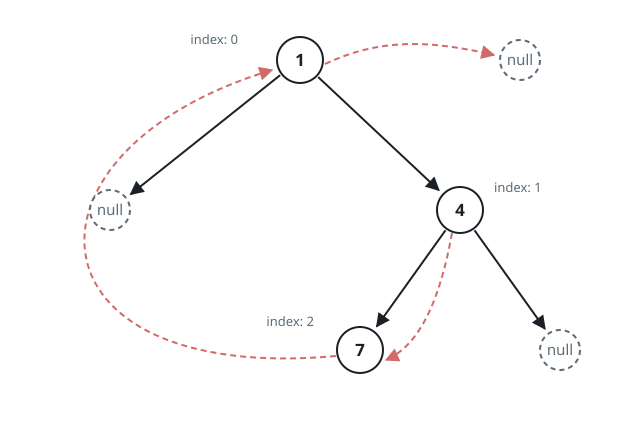
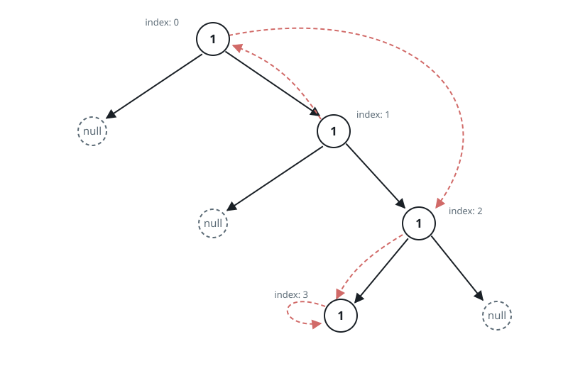

# Duplicate a Binary Tree With Random Links

## Description

Every node of the given binary tree carries its usual two child links
plus one extra link, which may aim at any node of the tree — or at
nothing at all.

Produce a duplicate of the tree: the same shape, the same values, and
every extra link aimed at the corresponding node of the duplicate.

Each node looks like this:

```text
class RandomTreeNode {
    public int val;
    public RandomTreeNode left;
    public RandomTreeNode right;
    public RandomTreeNode random;
}
```

The input arrives in level order, serialized exactly like an ordinary
binary tree, except that each present node is a `[val, random_index]`
pair where:

- `val`: the integer held in `RandomTreeNode.val`
- `random_index`: counted in level order across the tree's present
  nodes, with the root at `0`, the position of whichever node the extra
  link aims at — or null when it aims nowhere.

The answer is read back in the same `[val, random_index]` form, so the
duplicate must match the input in shape and in every link — and every
node it returns must be newly built: no node of the duplicate,
including the link targets, may be a node that was handed in.

### Example 1



```text
Input: root = [[1,null],null,[4,2],[7,0]]
Output: [[1,null],null,[4,2],[7,0]]
Explanation: The tree is the level-order list [1,null,4,7]: node 4 sits
to the right of the root, and node 7 is node 4's left child. The root's
extra link aims nowhere, hence [1, null]. Node 4's link aims at node 7,
third in level order, hence [4, 2]. Node 7's link aims back at the
root, hence [7, 0].
```

### Example 2



```text
Input: root = [[1,2],null,[1,0],null,[1,3],[1,3]]
Output: [[1,2],null,[1,0],null,[1,3],[1,3]]
Explanation: A node's extra link may aim at the node itself — the last
node in level order points at its own entry.
```

### Example 3


```text
Input: root = [[1,6],[2,5],[3,4],[4,3],[5,2],[6,1],[7,0]]
Output: [[1,6],[2,5],[3,4],[4,3],[5,2],[6,1],[7,0]]
```

### Constraints

- The tree holds between `0` and `1000` nodes.
- `1 <= RandomTreeNode.val <= 10^6`
- `RandomTreeNode.random` is null or aims at some node of the same tree.

### Follow up

Could the duplicate be built with no side registry — using space that
is constant beyond the duplicate itself?

## Hints

### Hint 1

Walk the tree and give every node a fresh counterpart. A link can reach
a node well before the walk arrives there, so note which counterpart
belongs to which original as you go — and key that record on the node
itself, never the value, because values repeat freely.

### Hint 2

Complete the record before wiring anything: a second pass can then aim
each counterpart's left, right, and extra link at the recorded
counterparts of the original's targets, and no lookup can miss.

### Hint 3

The record only names pairings the tree can store on its own: thread
each counterpart between its original and that original's left child,
read every far target as `original.random.left`, and finally unwind the
threading.
