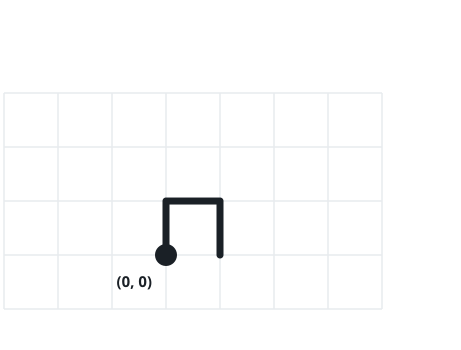
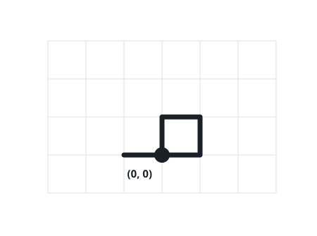

# Walk That Crosses Itself

## Description

You are handed a string `path` whose every character is one of `'N'`,
`'S'`, `'E'` or `'W'` — a step one unit north, south, east or west.
Beginning at the origin `(0, 0)` of the plane, follow the steps in
order.

Answer `true` if some point of the plane is landed on twice during the
stroll (the walk then crosses its own track), and `false` if every
visited position is new when reached.

### Example 1



```text
Input: path = "NES"
Output: false
Explanation: Each of the four positions along the way — including the
start — is visited exactly once.
```

### Example 2



```text
Input: path = "NESWW"
Output: true
Explanation: The final westward steps arrive back at the origin, which
the walk had already left once.
```

### Example 3

```text
Input: path = "ENWW"
Output: false
Explanation: The walk visits (1, 0), (1, 1), (0, 1) and (-1, 1) — four
distinct points, so no crossing happens.
```

### Example 4

```text
Input: path = "NEWS"
Output: true
Explanation: After stepping north and east, the next two west steps
land on (0, 1) — a point the walk had already stood on.
```

### Constraints

- `1 <= path.length <= 10⁴`
- Every character of `path` is `'N'`, `'S'`, `'E'`, or `'W'`.

## Hints

### Hint 1

Act the walk out step by step, remembering where you have already been.

### Hint 2

A set of visited coordinates turns each "have I been here?" question
into a constant-time lookup.
