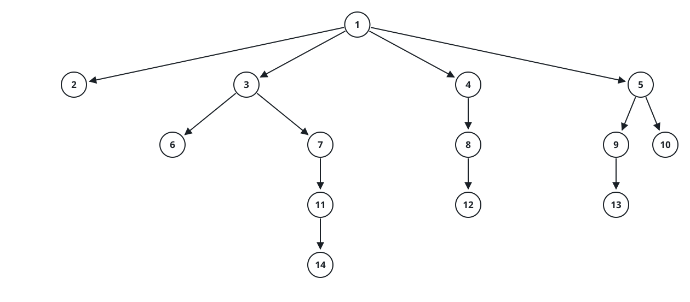
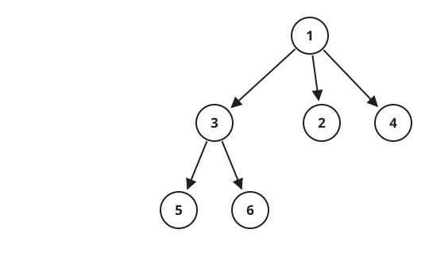

# Root Of A Scrambled N-ary Tree

## Description

Every node of an n-ary tree has been gathered into one array, with the
entries shuffled into an arbitrary order. Each node carries a unique value
and a list of its children:

```text
class Node {
    public int val;
    public List<Node> children;
}
```

The tree itself travels as a level-order serialization in which each run of
children is closed off by a `null` separator (see the diagram):



The tree above, for instance, serializes as
`[1,null,2,3,4,5,null,null,6,7,null,8,null,9,10,null,null,11,null,12,null,13,null,null,14]`.

Every test follows the same script: the judge decodes the serialization,
scatters its Node objects into an array, and hands that array to
`locateRoot`. The node you return is serialized back, and the test passes
only when the result matches the original input.

### Example 1



```text
Input: tree = [1,null,3,2,4,null,5,6]
Output: [1,null,3,2,4,null,5,6]
Explanation: The decoded tree is drawn above. The driver's array might read
[Node(5),Node(4),Node(3),Node(6),Node(2),Node(1)]; from those scattered
pieces, locateRoot must return Node(1), whose serialization is exactly the
input.
```

### Example 2


```text
Input: tree = [1,null,2,3,4,5,null,null,6,7,null,8,null,9,10,null,null,11,null,12,null,13,null,null,14]
Output: [1,null,2,3,4,5,null,null,6,7,null,8,null,9,10,null,null,11,null,12,null,13,null,null,14]
```

### Constraints

- The array holds between `1` and `5 * 10⁴` nodes in total.
- No two nodes share a value.

### Follow-up

Can you manage linear time while using only constant extra space?

## Hints

### Hint 1

Every node except the root is claimed exactly once as somebody's child, so
the root is the single node never sighted in a children list. Gather the
nodes, cross off each child you meet, and one node is left standing.

### Hint 2

To answer the follow-up, stop storing nodes altogether. Any non-root value
shows up twice in the arithmetic — once as a node, once as a child — while
the root's value shows up once, so an accumulator that makes paired values
cancel (a running sum, or an XOR) ends up holding exactly the root's value.
