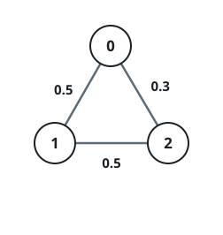
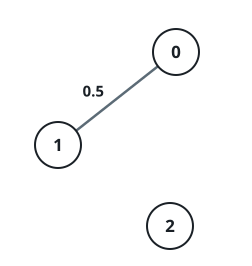

# Most Reliable Route

## Description

An undirected graph has `n` nodes labeled `0` through `n - 1`. It comes
as an edge list: `edges[i] = [a, b]` links nodes `a` and `b`, and
`succProb[i]` is the chance that a crossing of that link succeeds.

A route from `start_node` to `end_node` succeeds with a probability
equal to the product of its links' chances. Among all routes between the
two nodes, return the highest success probability. When they are
disconnected, return `0`. An answer within `1e-5` of the true value is
accepted.

### Example 1


```text
Input: n = 3, edges = [[0,1],[1,2],[0,2]], succProb = [0.5,0.5,0.2], start_node = 0, end_node = 2
Output: 0.25000
Explanation: The two-hop route 0 -> 1 -> 2 succeeds with 0.5 * 0.5 =
0.25, while hopping straight along 0 -> 2 manages only 0.2.
```

### Example 2



```text
Input: n = 3, edges = [[0,1],[1,2],[0,2]], succProb = [0.5,0.5,0.3], start_node = 0, end_node = 2
Output: 0.30000
Explanation: With the direct link strengthened to 0.3, one hop now beats
the two-hop chain worth 0.25.
```

### Example 3



```text
Input: n = 3, edges = [[0,1]], succProb = [0.5], start_node = 0, end_node = 2
Output: 0.00000
Explanation: Nothing links to node 2, so the two endpoints are
disconnected.
```

### Constraints

- `2 <= n <= 10⁴`
- `0 <= start_node, end_node < n`
- `start_node != end_node`
- `0 <= a, b < n` for every `edges[i] = [a, b]`
- `a != b`
- `0 <= succProb.length == edges.length <= 2 × 10⁴`
- `0 <= succProb[i] <= 1`
- Between any two nodes there is at most one edge.

## Hints

### Hint 1

Every edge factor is at most `1`, so extending a route can never raise
its success chance — a best-first search may settle a node once no
unexplored route can still beat its current value.

### Hint 2

Products of many small factors lose precision; switch to sums by working
with the logarithm of each edge chance.

### Hint 3

Negated log-chances are ordinary non-negative edge costs, which hands
the problem to Dijkstra's algorithm.
