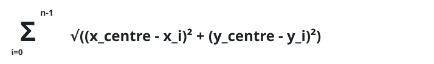
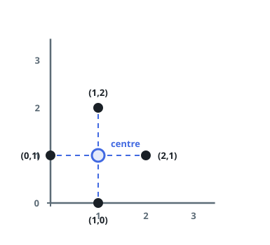
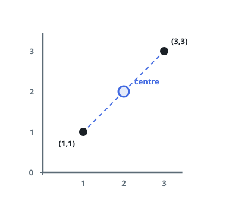

# Where the Service Centre Belongs

## Description

A delivery firm is opening a single service centre to cover all of its
customers, whose homes sit on a 2D map. The spot should make the total
straight-line distance to every customer as small as possible.

Given `positions`, where `positions[i] = [xi, yi]` locates the `i`-th
customer, choose the centre's position `[x_centre, y_centre]` minimizing
the sum, over all customers `i`, of the distance between
`[x_centre, y_centre]` and `[xi, yi]`, and return that smallest total.



Answers within `10⁻⁵` of the true total are accepted.

### Example 1



```text
Input: positions = [[0,1],[1,0],[1,2],[2,1]]
Output: 4.00000
Explanation: The four customers surround [1, 1] at distance 1 each, so
that spot costs exactly 4 — and no placement can beat it.
```

### Example 2



```text
Input: positions = [[1,1],[3,3]]
Output: 2.82843
Explanation: With only two customers, the best possible total is their
separation, sqrt(2) + sqrt(2) = 2.82843, reached by any centre on the
segment joining them.
```

### Example 3

```text
Input: positions = [[0,0],[6,0],[3,5]]
Output: 10.19615
Explanation: The customers form an isosceles triangle, and the optimal
centre waits inside it on the axis of symmetry; the three distances from
there add up to roughly 10.19615.
```

### Constraints

- `1 <= positions.length <= 50`
- `positions[i].length == 2`
- `0 <= xi, yi <= 100`

## Hints

### Hint 1

The point that minimizes a sum of Euclidean distances is the geometric
median of the set, and outside of special cases it admits no closed
formula — plan to search or iterate for it.

### Hint 2

One reliable iteration is a re-weighted average: each customer pulls the
current guess toward itself with a strength inversely proportional to
how far away it currently is, and the process settles exactly at the
geometric median.
