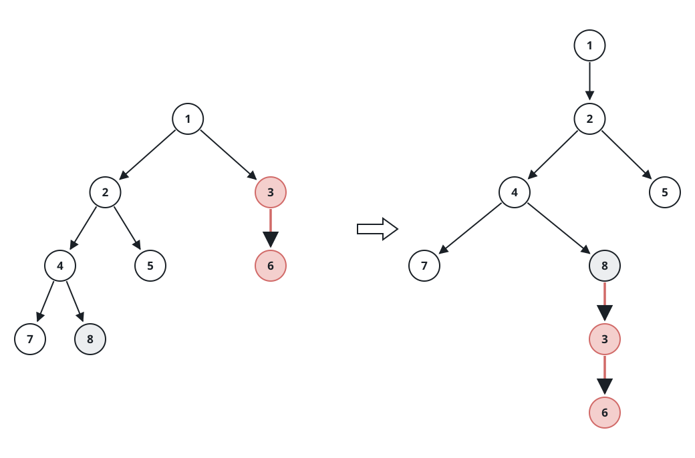
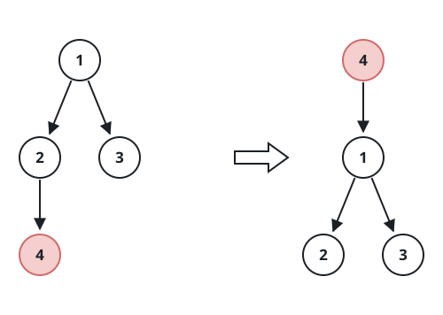

# Transplanting a Subtree

## Description

An n-ary tree with unique values is given through its `root`, together
with two of its nodes, `p` and `q`. Transplant the subtree rooted at
`p`: detach it from where it hangs and re-hang it so that it becomes a
direct child of `q`, sitting last in `q`'s children list. Return the
root of the tree after the rewiring. When `p` already hangs directly
under `q`, the tree must come back unchanged.

Where the two nodes sit relative to each other admits exactly three
situations:

- `q` lies inside the subtree of `p`;
- `p` lies inside the subtree of `q`;
- neither node lies inside the other's subtree.

In the last two situations the transplant is a plain re-hang: lift `p`
together with its entire subtree and drop it under `q`. The first
situation is the delicate one — lifting `p` would carry `q` off with it
while `q` is also the node that must keep the rest of the tree
connected — so `q` has to be lowered into the very slot `p` is lifted
out of, and when `p` is the root itself, `q` succeeds it as the new
root. The examples below cover every situation; read them carefully
before solving.

The n-ary tree arrives as a level-order serialization in which a null
marker closes each group of children (see the examples).


For example, the tree above serializes to
[1,null,2,3,4,5,null,null,6,7,null,8,null,9,10,null,null,11,null,12,null,13,null,null,14].

### Example 1


```text
Input: root = [1,null,2,3,null,4,5,null,6,null,7,8], p = 4, q = 1
Output: [1,null,2,3,4,null,5,null,6,null,7,8]
Explanation: p lies inside the subtree of q, so this is the plain
re-hang: node 4 travels with its whole subtree and lands as the last
child of node 1.
```

### Example 2


```text
Input: root = [1,null,2,3,null,4,5,null,6,null,7,8], p = 7, q = 4
Output: [1,null,2,3,null,4,5,null,6,null,7,8]
Explanation: p already hangs directly under q, so the tree stays exactly
as it was.
```

### Example 3



```text
Input: root = [1,null,2,3,null,4,5,null,6,null,7,8], p = 3, q = 8
Output: [1,null,2,null,4,5,null,7,8,null,null,null,3,null,6]
Explanation: Neither node lies inside the other's subtree: node 3 is
unhooked from node 1 and re-hung as the last child of node 8.
```

### Example 4



```text
Input: root = [1,null,2,3,null,4], p = 1, q = 4
Output: [4,null,1,null,2,3]
Explanation: q lies inside the subtree of p: node 4 is freed from its
parent, takes over the root slot that p vacates, and the old root is
appended as node 4's last child.
```

### Constraints

- The tree holds between `2` and `1000` nodes.
- Every node carries a distinct value.
- `p` and `q` are two distinct nodes of the tree.

## Hints

### Hint 1

Every situation starts from the same two edits: unhook `p` from its
parent, then append it to the back of `q`'s children.

### Hint 2

The delicate situation is `q` living inside `p`'s subtree — unhooking
`p` first would strand everything else. Lower `q` into the slot `p`
vacates (its place in its parent's children list, or the root position
when `p` is the root) before appending `p` to `q`.

### Hint 3

The rewiring needs only two facts gathered up front: the parent `p`
hangs from, and whether `q` sits inside `p`'s subtree. One traversal can
carry both.
