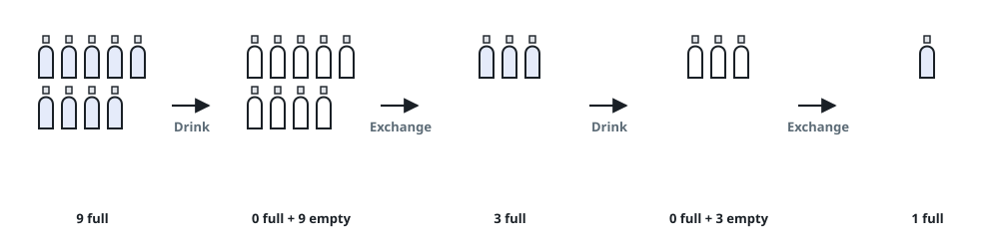
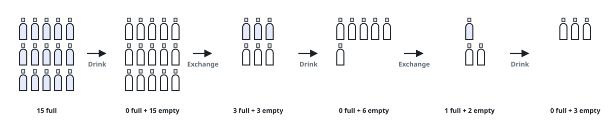

# Bottle Trade-Ins

## Description

You begin holding `numBottles` full bottles. Drinking one turns it into
an empty bottle, and the store hands you a fresh full bottle in exchange
for every `numExchange` empties you turn in.

Given `numBottles` and `numExchange`, return the largest total number of
bottles you can drink.

### Example 1



```text
Input: numBottles = 9, numExchange = 3
Output: 13
Explanation: Drink the 9 you start with, trade the 9 empties for 3 full
bottles and drink those, then trade the 3 fresh empties for 1 more and
drink it: 9 + 3 + 1 = 13.
```

### Example 2



```text
Input: numBottles = 15, numExchange = 4
Output: 19
Explanation: Drink the 15 you start with, then trade 12 of the empties
for 3 full bottles and drink those. With 6 empties left you can still
afford one more trade, netting a final bottle: 15 + 3 + 1 = 19, and the
3 empties that remain fall short of another exchange.
```

### Constraints

- `1 <= numBottles <= 100`
- `2 <= numExchange <= 100`

## Hints

### Hint 1

Keep going round after round — drink what you hold, turn empties in for
full ones — until your empties no longer cover even a single exchange.
